# Tài liệu Phân tích và Thiết kế
## Nhóm chức năng 5: Quản trị hệ thống (Admin)

## A. Cập nhật phần đã có

# I. Mô tả hệ thống

## 1. Mô tả chung về hệ thống, lý do lựa chọn

Hệ thống Room Finding And Rental System là phần mềm hỗ trợ kết nối giữa người có nhu cầu thuê phòng, chủ trọ và bộ phận quản trị. Hệ thống cho phép người dùng đăng ký, đăng nhập, tìm kiếm phòng trọ, đăng bài cho thuê, đăng bài tìm phòng và quản lý thông tin cá nhân.

Trong phạm vi nhóm chức năng quản trị hệ thống, Admin chịu trách nhiệm kiểm soát dữ liệu, duyệt nội dung và đảm bảo môi trường sử dụng an toàn, minh bạch. Các chức năng quản trị bao gồm quản lý người dùng, quản lý bài đăng cho thuê, quản lý bài đăng tìm phòng và theo dõi tổng quan hệ thống qua dashboard.

Lý do lựa chọn nhóm chức năng Admin:

- **Đảm bảo chất lượng nội dung:** Bài đăng cần được kiểm duyệt để tránh thông tin sai lệch, spam hoặc nội dung vi phạm.
- **Đảm bảo an toàn người dùng:** Admin có thể quản lý vai trò, cập nhật thông tin và xử lý tài khoản không phù hợp.
- **Hỗ trợ vận hành hệ thống:** Dashboard giúp theo dõi số lượng người dùng, bài đăng và hoạt động gần đây.
- **Tăng độ tin cậy của nền tảng:** Một hệ thống cho thuê phòng cần cơ chế quản trị để duy trì tính minh bạch và tin cậy.

## 2. Khảo sát hệ thống tương tự

Một số hệ thống tương tự trên thị trường:

| Hệ thống | Chức năng liên quan | Nhận xét |
|---|---|---|
| Chotot Nhà | Quản lý tin đăng, kiểm duyệt tin, lọc tin vi phạm | Có quy trình duyệt nội dung trước/sau khi hiển thị |
| Batdongsan.com.vn | Quản lý tài khoản, tin đăng, trạng thái hiển thị | Phân quyền rõ giữa người đăng tin và bộ phận kiểm duyệt |
| Airbnb | Quản lý người dùng, đánh giá, báo cáo vi phạm | Tập trung mạnh vào uy tín người dùng và kiểm soát nội dung |
| Facebook Marketplace | Quản lý bài đăng, báo cáo spam, xóa nội dung vi phạm | Phụ thuộc nhiều vào báo cáo cộng đồng và thuật toán lọc |

Qua khảo sát, các hệ thống đều cần vai trò quản trị để kiểm soát tài khoản và bài đăng. Vì vậy, nhóm chức năng Admin là thành phần quan trọng trong hệ thống tìm và cho thuê phòng.

# II. Thu thập yêu cầu

## 1. Bảng thuật ngữ

| Thuật ngữ | Ý nghĩa |
|---|---|
| Admin / Quản trị viên | Người có quyền quản lý toàn bộ dữ liệu và nội dung trong hệ thống |
| User / Người dùng | Tài khoản sử dụng hệ thống, có thể là người thuê, chủ trọ hoặc quản trị viên |
| Người thuê | Người tìm phòng hoặc đăng bài tìm phòng |
| Chủ trọ | Người đăng bài cho thuê phòng |
| Bài đăng cho thuê | Bài viết mô tả phòng trọ cho thuê, gồm giá, diện tích, địa chỉ, hình ảnh, trạng thái |
| Bài đăng tìm phòng | Bài viết thể hiện nhu cầu tìm phòng của người thuê |
| Trạng thái bài đăng | Tình trạng xử lý của bài đăng, ví dụ: PENDING, APPROVED, REJECTED |
| Phân quyền | Việc gán vai trò cho user: nguoi_thue, chu_tro, quan_tri_vien |
| Dashboard | Màn hình tổng quan số liệu hệ thống dành cho Admin |
| Vô hiệu hóa tài khoản | Tạm khóa tài khoản để ngăn người dùng tiếp tục sử dụng hệ thống |
| Kích hoạt tài khoản | Mở lại tài khoản đã bị vô hiệu hóa |

## 2. Mô hình nghiệp vụ bằng ngôn ngữ tự nhiên

### Mục tiêu và phạm vi hệ thống

Mục tiêu của nhóm chức năng Admin là hỗ trợ quản trị viên kiểm soát người dùng, bài đăng và theo dõi tình hình hoạt động tổng quan của hệ thống.

Phạm vi bao gồm:

- Quản lý thông tin và vai trò người dùng.
- Duyệt, xóa và thống kê bài đăng cho thuê.
- Xóa và thống kê bài đăng tìm phòng.
- Hiển thị dashboard tổng quan hệ thống.

### Ai có thể sử dụng phần mềm?

Trong phạm vi nhóm quản trị, người sử dụng chính là Admin. Admin phải đăng nhập thành công và có vai trò `quan_tri_vien`. Hệ thống hiện có cơ chế bảo vệ endpoint `/api/admin` bằng phân quyền Spring Security `hasRole('QUAN_TRI_VIEN')`.

Các đối tượng liên quan khác:

- **Người thuê:** Tạo bài tìm phòng, xem bài đăng.
- **Chủ trọ:** Tạo bài cho thuê, quản lý bài của mình.
- **Khách chưa đăng nhập:** Có thể xem một số thông tin công khai tùy cấu hình hệ thống.

### Người dùng có những chức năng gì?

Admin có các nhóm chức năng:

- **Quản lý người dùng:** Xem danh sách user, xem chi tiết, phân quyền, cập nhật thông tin, vô hiệu hóa/kích hoạt tài khoản.
- **Quản lý bài đăng cho thuê:** Xem tất cả bài đăng, duyệt bài, xóa bài vi phạm, thống kê bài theo trạng thái.
- **Quản lý bài đăng tìm phòng:** Xem tất cả bài tìm phòng, xóa bài vi phạm, thống kê số lượng bài tìm phòng.
- **Dashboard Admin:** Xem số lượng user theo role, số lượng bài đăng theo trạng thái và hoạt động gần đây.

### Mỗi chức năng hoạt động ra sao?

#### Quản lý người dùng

Admin truy cập trang quản trị, hệ thống kiểm tra token và role. Nếu hợp lệ, Admin có thể lấy danh sách user. Khi xem chi tiết, hệ thống hiển thị id, email, role, ngày tạo và các thông tin liên quan. Admin có thể cập nhật thông tin hoặc gán role mới. Khi thay đổi role, hệ thống kiểm tra role hợp lệ rồi lưu vào cơ sở dữ liệu.

Trong source code hiện tại, phần quản lý user đã có các endpoint chính trong `AdminController`:

- `GET /api/admin/users`
- `GET /api/admin/users/{id}`
- `PUT /api/admin/assign-role/{id}`
- `PUT /api/admin/update-user/{id}`
- `DELETE /api/admin/delete-user/{id}`

Chức năng vô hiệu hóa/kích hoạt tài khoản là yêu cầu nghiệp vụ cần bổ sung trường trạng thái tài khoản nếu triển khai đầy đủ.

#### Quản lý bài đăng cho thuê

Admin xem danh sách bài đăng cho thuê. Bài mới thường có trạng thái `PENDING`. Admin xem chi tiết bài, kiểm tra nội dung, hình ảnh, địa chỉ, giá và thông tin người đăng. Nếu hợp lệ, Admin duyệt bài sang `APPROVED`. Nếu không hợp lệ, Admin từ chối hoặc xóa bài.

Source code hiện tại có:

- `GET /api/baidang/all`
- `GET /api/baidang/status/{status}`
- `GET /api/baidang/{id}`
- `PUT /api/baidang/{id}/status?status=...&role=ADMIN`
- `DELETE /api/baidang/{id}`

Giao diện `admin.html` và `admin.js` hiện tập trung vào quản lý bài đăng chờ duyệt.

#### Quản lý bài đăng tìm phòng

Admin xem danh sách bài đăng tìm phòng, lọc theo khu vực, giá, diện tích hoặc trạng thái nếu có. Khi phát hiện nội dung vi phạm, Admin xóa bài. Hệ thống cập nhật lại danh sách và thống kê.

Source code hiện tại có:

- `GET /api/baidangtimphong/`
- `GET /api/baidangtimphong/{id}`
- `DELETE /api/baidangtimphong/{id}`
- `PUT /api/baidangtimphong/{id}`

#### Dashboard Admin

Dashboard tổng hợp dữ liệu từ các module:

- Số lượng user theo role.
- Số lượng bài đăng cho thuê theo trạng thái.
- Số lượng bài tìm phòng.
- Hoạt động gần đây như user mới, bài mới, bài vừa được duyệt/xóa.

Trong source code hiện tại, dashboard tổng hợp chưa có endpoint riêng. Có thể xây dựng bằng service tổng hợp từ các repository hiện có.

### Những thông tin/đối tượng mà hệ thống cần xử lý

- User
- Vai trò người dùng
- Bài đăng cho thuê
- Bài đăng tìm phòng
- Hình ảnh phòng trọ
- Trạng thái bài đăng
- Thống kê hệ thống
- Hoạt động gần đây

### Quan hệ giữa các đối tượng

- Một User có thể tạo nhiều bài đăng cho thuê.
- Một User có thể tạo nhiều bài đăng tìm phòng.
- Một bài đăng cho thuê có nhiều hình ảnh.
- Admin là User có role `quan_tri_vien` và có quyền quản lý các đối tượng trên.

## 3. Mô hình nghiệp vụ bằng UML

### Xác định các actor của hệ thống

Các actor trong phạm vi Admin:

- **Admin:** Tác nhân chính, thực hiện toàn bộ chức năng quản trị.
- **Hệ thống xác thực:** Kiểm tra token, role và quyền truy cập.
- **Người dùng:** Đối tượng bị quản lý.
- **Chủ trọ:** Người tạo bài cho thuê, chịu ảnh hưởng bởi duyệt/xóa bài.
- **Người thuê:** Người tạo bài tìm phòng, chịu ảnh hưởng bởi quản lý nội dung.

### Use case cho từng actor

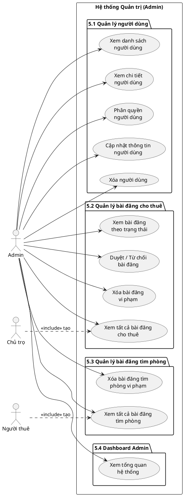
```plantuml
@startuml
left to right direction

actor "Admin" as Admin
actor "Chủ trọ" as ChTro
actor "Người thuê" as NguoiThue

rectangle "Hệ thống Quản trị (Admin)" {
    package "5.1 Quản lý người dùng" {
        usecase "Xem danh sách\nngười dùng" as U1
        usecase "Xem chi tiết\nngười dùng" as U2
        usecase "Phân quyền\nngười dùng" as U3
        usecase "Cập nhật thông tin\nngười dùng" as U4
        usecase "Xóa người dùng" as U5
    }

    package "5.2 Quản lý bài đăng cho thuê" {
        usecase "Xem tất cả bài đăng\ncho thuê" as R1
        usecase "Xem bài đăng\ntheo trạng thái" as R2
        usecase "Duyệt / Từ chối\nbài đăng" as R3
        usecase "Xóa bài đăng\nvi phạm" as R4
    }

    package "5.3 Quản lý bài đăng tìm phòng" {
        usecase "Xem tất cả bài đăng\ntìm phòng" as S1
        usecase "Xóa bài đăng tìm\nphòng vi phạm" as S2
    }

    package "5.4 Dashboard Admin" {
        usecase "Xem tổng quan\nhệ thống" as D1
    }
}

Admin --> U1
Admin --> U2
Admin --> U3
Admin --> U4
Admin --> U5
Admin --> R1
Admin --> R2
Admin --> R3
Admin --> R4
Admin --> S1
Admin --> S2
Admin --> D1

ChTro ..> R1 : <<include>> tạo
NguoiThue ..> S1 : <<include>> tạo
@enduml
```

## 4. Bảng yêu cầu người dùng

| ID | Mô tả yêu cầu | Độ ưu tiên |
|---|---|---|
| ADM-01 | Admin có thể đăng nhập và truy cập trang quản trị khi có role `quan_tri_vien` | Cao |
| ADM-02 | Admin có thể xem danh sách tất cả người dùng | Cao |
| ADM-03 | Admin có thể xem chi tiết user gồm id, email, role, ngày tạo | Cao |
| ADM-04 | Admin có thể phân quyền user | Cao |
| ADM-05 | Admin có thể cập nhật thông tin user | Cao |
| ADM-06 | Admin có thể vô hiệu hóa hoặc kích hoạt tài khoản _(yêu cầu bổ sung trường `enabled` vào entity `User`)_ | Thấp |
| ADM-07 | Admin có thể xem tất cả bài đăng cho thuê | Cao |
| ADM-08 | Admin có thể duyệt bài đăng cho thuê | Cao |
| ADM-09 | Admin có thể xóa bài đăng cho thuê vi phạm/spam | Cao |
| ADM-10 | Admin có thể xem thống kê bài đăng cho thuê theo trạng thái | Trung bình |
| ADM-11 | Admin có thể xem tất cả bài đăng tìm phòng | Cao |
| ADM-12 | Admin có thể xóa bài đăng tìm phòng vi phạm/spam | Cao |
| ADM-13 | Admin có thể thống kê số lượng bài tìm phòng | Trung bình |
| ADM-14 | Admin có thể xem dashboard tổng quan hệ thống | Cao |
| ADM-15 | Dashboard hiển thị hoạt động gần đây | Trung bình |

# III. Phân tích

## 1. UC Specification

### UC-ADM-01: Xem Dashboard Admin

**Use Case ID:** UC-ADM-01
**Use Case Name:** Xem Dashboard Admin
**Description:** Admin truy cập màn hình tổng quan hệ thống để xem thống kê về người dùng, bài đăng cho thuê và bài đăng tìm phòng.
**Actor(s):** Admin
**Priority:** Cao
**Trigger:** Admin click vào tab Dashboard trong trang quản trị.
**Pre-Condition(s):**
- Admin đã đăng nhập thành công vào hệ thống.
- Admin có role `quan_tri_vien`.
- Token JWT hợp lệ và chưa hết hạn.
**Post-Condition(s):**
- Hệ thống hiển thị đầy đủ số liệu thống kê tổng quan.
- Dữ liệu được truy vấn từ các repository và trả về dưới dạng JSON.
**Basic Flow:**
1. Admin click tab Dashboard trên giao diện admin.
2. Hệ thống gửi request `GET /api/admin/dashboard` kèm JWT Bearer token.
3. `JwtAuthenticationFilter` kiểm tra token và xác thực quyền `ROLE_QUAN_TRI_VIEN`.
4. `AdminController` nhận request, gọi `AdminService.getDashboardStats()`.
5. `AdminService` truy vấn `UserRepository` để đếm user theo role (nguoi_thue, chu_tro, quan_tri_vien).
6. `AdminService` truy vấn `BaiDangRepository` để đếm bài đăng theo trạng thái (PENDING, APPROVED, REJECTED).
7. `AdminService` truy vấn `BaiDangTimPhongRepository` để đếm tổng số bài tìm phòng.
8. `AdminService` gộp dữ liệu thành `Map<String, Object>` và trả về `AdminController`.
10. `AdminController` trả về HTTP 200 OK với JSON chứa thống kê.
11. Giao diện hiển thị dashboard với các số liệu đã truy vấn.
**Alternative Flow:**
- 5a. Nếu không có user nào trong hệ thống: `totalUsers = 0`, các số liệu role = 0.
- 6a. Nếu không có bài đăng cho thuê: `totalPosts = 0`, `pendingPosts = 0`, `approvedPosts = 0`, `rejectedPosts = 0`.
- 7a. Nếu không có bài đăng tìm phòng: `totalTimPhong = 0`.
**Exception Flow:**
- 3a. Nếu token hết hạn hoặc không hợp lệ: `JwtAuthenticationFilter` từ chối, trả về HTTP 401 Unauthorized.
- 3b. Nếu user không có role `quan_tri_vien`: Spring Security từ chối, trả về HTTP 403 Forbidden.
- 4a. Nếu `AdminService` gặp lỗi truy vấn DB: trả về HTTP 500 Internal Server Error.
**Business Rules:**
- BR-01: Chỉ user có role `quan_tri_vien` mới được truy cập endpoint `/api/admin/dashboard`.
- BR-02: Thống kê phải phản ánh dữ liệu thực tại thời điểm truy vấn.
**Non-Functional Requirement:**
- NFR-01: Thời gian phản hồi dashboard không quá 2 giây với cơ sở dữ liệu < 100.000 bản ghi.

---

### UC-ADM-02: Quản lý người dùng

**Use Case ID:** UC-ADM-02
**Use Case Name:** Quản lý người dùng
**Description:** Admin xem danh sách người dùng, xem chi tiết, phân quyền (gán role), cập nhật thông tin cá nhân và xóa tài khoản người dùng.
**Actor(s):** Admin
**Priority:** Cao
**Trigger:** Admin click tab Quản lý người dùng trong trang quản trị.
**Pre-Condition(s):**
- Admin đã đăng nhập thành công.
- Admin có role `quan_tri_vien`.
- Token JWT hợp lệ.
**Post-Condition(s):**
- Thông tin user được cập nhật trong cơ sở dữ liệu.
- Role user được thay đổi (nếu có).
- User bị xóa khỏi hệ thống (nếu có).
**Basic Flow:**
1. Admin click tab Quản lý người dùng.
2. Hệ thống gửi `GET /api/admin/users` kèm JWT token.
3. `AdminController` nhận request, gọi `AdminService.getAllUsers()`.
4. `AdminService` gọi `UserRepository.findAll()`, trả về danh sách user.
5. `AdminController` trả về JSON danh sách user.
6. Admin chọn một user để xem chi tiết.
7. Hệ thống gửi `GET /api/admin/users/{id}`.
8. `AdminService` gọi `UserRepository.findById(id)`, trả về thông tin user.
9. Admin chọn chức năng phân quyền (assign role).
10. Hệ thống gửi `PUT /api/admin/assign-role/{id}?role={role}`.
11. `AdminService` tìm user, kiểm tra role hợp lệ (nguoi_thue | chu_tro | quan_tri_vien).
12. `AdminService` cập nhật role, set `ngay_cap_nhat = now()`, lưu vào DB.
13. `AdminService` trả về thông báo thành công.
14. Admin chọn chức năng cập nhật thông tin user.
15. Hệ thống gửi `PUT /api/admin/update-user/{id}` với body `UserDTO`.
16. `AdminService` tìm user, cập nhật fullname, email, so_dien_thoai, hash_password (nếu có).
17. `AdminService` lưu user vào DB, trả về thông báo thành công.
18. Admin chọn chức năng xóa user.
19. Hệ thống gửi `DELETE /api/admin/delete-user/{id}`.
20. `AdminService` kiểm tra user tồn tại, gọi `UserRepository.deleteById(id)`.
21. `AdminService` trả về thông báo xóa thành công.
**Alternative Flow:**
- 8a. Nếu user không tồn tại: trả về HTTP 200 với body rỗng (Optional.empty()).
- 11a. Nếu role không hợp lệ: `IllegalArgumentException`, trả về thông báo "Role không hợp lệ!".
- 16a. Nếu email đã tồn tại ở user khác: `DataIntegrityViolationException`, trả về lỗi 409 Conflict.
- 20a. Nếu user không tồn tại: trả về thông báo "User không tồn tại!".
**Exception Flow:**
- 2a. Token hết hạn: HTTP 401 Unauthorized, redirect về trang đăng nhập.
- 2b. Không đủ quyền: HTTP 403 Forbidden.
- 20b. Nếu user đang có bài đăng liên kết (FK constraint): `DataIntegrityViolationException`, HTTP 409 Conflict.
**Business Rules:**
- BR-03: Chỉ admin mới được phép xem danh sách user, phân quyền, cập nhật và xóa user.
- BR-04: Role hợp lệ gồm: `nguoi_thue`, `chu_tro`, `quan_tri_vien`.
- BR-05: Không cho phép xóa chính tài khoản admin đang đăng nhập.
- BR-06: Khi cập nhật thông tin, `ngay_cap_nhat` phải được cập nhật thành thời gian hiện tại.
**Non-Functional Requirement:**
- NFR-02: Danh sách user phải được tải trong vòng 1 giây với < 10.000 user.
- NFR-03: Thao tác phân quyền và cập nhật phải có phản hồi trong vòng 500ms.

---

### UC-ADM-03: Duyệt bài đăng cho thuê

**Use Case ID:** UC-ADM-03
**Use Case Name:** Duyệt bài đăng cho thuê
**Description:** Admin xem danh sách bài đăng cho thuê đang ở trạng thái PENDING, kiểm tra nội dung và quyết định duyệt (APPROVED) hoặc từ chối (REJECTED) bài đăng.
**Actor(s):** Admin
**Priority:** Cao
**Trigger:** Admin click tab Duyệt bài trong trang quản trị.
**Pre-Condition(s):**
- Admin đã đăng nhập và có role `quan_tri_vien`.
- Bài đăng cho thuê đang ở trạng thái `PENDING`.
**Post-Condition(s):**
- Trạng thái bài đăng được cập nhật thành `APPROVED` hoặc `REJECTED`.
- `ngay_cap_nhat` của bài đăng được cập nhật.
- Bài đăng hiển thị công khai nếu được duyệt (APPROVED).
**Basic Flow:**
1. Admin click tab Duyệt bài / Quản lý bài đăng.
2. Hệ thống gửi `GET /api/baidang/status/PENDING` kèm JWT token.
3. `BaiDangController` nhận request, kiểm tra role admin qua `SecurityContextHolder`.
4. `BaiDangController` gọi `BaiDangService.getByStatus(PENDING)`.
5. `BaiDangService` gọi `BaiDangRepository.findByTrangThai(PENDING)`.
6. `BaiDangRepository` truy vấn DB, trả về danh sách bài `PENDING`.
7. Hệ thống hiển thị danh sách bài chờ duyệt.
8. Admin chọn một bài đăng để xem chi tiết.
9. Hệ thống gửi `GET /api/baidang/{id}`.
10. `BaiDangService` trả về thông tin chi tiết bài đăng.
11. Admin click nút "Duyệt".
12. Hệ thống gửi `PUT /api/baidang/{id}/status?status=APPROVED`.
13. `BaiDangController` kiểm tra `@PreAuthorize("hasRole('QUAN_TRI_VIEN')")`.
14. `BaiDangController` gọi `BaiDangService.updateStatus(id, APPROVED)`.
15. `BaiDangService` tìm bài đăng, set `trangThai = APPROVED`, lưu DB.
16. Hệ thống trả về thông báo duyệt thành công.
**Alternative Flow:**
- 11a. Admin click nút "Từ chối":
  - 11a.1. Hệ thống gửi `PUT /api/baidang/{id}/status?status=REJECTED`.
  - 11a.2. `BaiDangService` cập nhật `trangThai = REJECTED`.
  - 11a.3. Hệ thống trả về thông báo từ chối thành công.
- 6a. Nếu không có bài `PENDING`: hiển thị danh sách rỗng.
- 10a. Nếu bài đăng không tồn tại: `RuntimeException`, HTTP 500.
**Exception Flow:**
- 3a. Nếu user không phải admin khi gọi `GET /api/baidang/status/PENDING`: `AccessDeniedException`, HTTP 403.
- 13a. Nếu token hết hạn khi gọi `PUT /api/baidang/{id}/status`: HTTP 401.
- 15a. Nếu bài đăng không tồn tại: `RuntimeException` "Không tìm thấy bài đăng", HTTP 500.
**Business Rules:**
- BR-07: Chỉ admin mới được xem bài đăng ở trạng thái `PENDING`.
- BR-08: Chỉ admin mới được cập nhật trạng thái bài đăng qua endpoint `PUT /api/baidang/{id}/status`.
- BR-09: Trạng thái hợp lệ: `PENDING`, `APPROVED`, `REJECTED`.
- BR-10: Khi duyệt bài, `ngay_cap_nhat` phải được cập nhật.
**Non-Functional Requirement:**
- NFR-04: Danh sách bài chờ duyệt phải load trong vòng 1 giây.

---

### UC-ADM-04: Quản lý bài đăng cho thuê

**Use Case ID:** UC-ADM-04
**Use Case Name:** Quản lý bài đăng cho thuê
**Description:** Admin xem toàn bộ danh sách bài đăng cho thuê (không phân biệt trạng thái), xem chi tiết và xóa bài đăng vi phạm hoặc spam.
**Actor(s):** Admin
**Priority:** Cao
**Trigger:** Admin click tab Quản lý bài đăng cho thuê trong trang quản trị.
**Pre-Condition(s):**
- Admin đã đăng nhập và có role `quan_tri_vien`.
- Bài đăng cho thuê tồn tại trong hệ thống.
**Post-Condition(s):**
- Bài đăng vi phạm bị xóa khỏi cơ sở dữ liệu.
- Danh sách bài đăng được cập nhật.
**Basic Flow:**
1. Admin click tab Quản lý bài đăng cho thuê.
2. Hệ thống gửi `GET /api/admin/posts` hoặc `GET /api/admin/posts/paged?page=0&size=10`.
3. `AdminController` gọi `AdminService.getAllBaiDang()` hoặc `getAllBaiDangPaged(pageable)`.
4. `AdminService` gọi `BaiDangRepository.findAll()`, trả về toàn bộ bài đăng.
5. Hệ thống hiển thị danh sách bài đăng với phân trang.
6. Admin chọn một bài đăng để xem chi tiết (click eye icon).
7. Hệ thống gửi `GET /api/baidang/{id}`.
8. `BaiDangService` trả về chi tiết bài đăng.
9. Admin click nút "Xóa" trên bài đăng.
10. Hệ thống hiển thị hộp thoại xác nhận xóa.
11. Admin xác nhận xóa.
12. Hệ thống gửi `DELETE /api/baidang/{id}`.
13. `BaiDangController` kiểm tra quyền: admin hoặc chính chủ bài đăng.
14. `BaiDangController` gọi `BaiDangService.deleteBaiDang(id)`.
15. `BaiDangService` gọi `BaiDangRepository.deleteById(id)`.
16. Hệ thống trả về HTTP 200 OK, cập nhật danh sách.
**Alternative Flow:**
- 4a. Nếu không có bài đăng nào: hiển thị danh sách rỗng.
- 10a. Admin hủy xác nhận xóa: đóng hộp thoại, không thực hiện xóa.
- 13a. Nếu user không phải admin và không phải chủ bài: `AccessDeniedException`, HTTP 403.
**Exception Flow:**
- 2a. Token hết hạn: HTTP 401.
- 2b. Không đủ quyền: HTTP 403.
- 15a. Nếu bài đăng không tồn tại: `RuntimeException`, HTTP 500.
**Business Rules:**
- BR-11: Admin có quyền xóa bất kỳ bài đăng cho thuê nào.
- BR-12: Chủ bài đăng chỉ được xóa bài của chính mình.
- BR-13: Xóa bài đăng sẽ xóa hoàn toàn bản ghi khỏi DB (không có trạng thái DELETED).
**Non-Functional Requirement:**
- NFR-05: Danh sách bài đăng phân trang phải load trong vòng 1 giây.

---

### UC-ADM-05: Quản lý bài đăng tìm phòng

**Use Case ID:** UC-ADM-05
**Use Case Name:** Quản lý bài đăng tìm phòng
**Description:** Admin xem toàn bộ danh sách bài đăng tìm phòng có phân trang, xem chi tiết và xóa bài đăng vi phạm hoặc spam.
**Actor(s):** Admin
**Priority:** Cao
**Trigger:** Admin click tab Quản lý bài đăng tìm phòng trong trang quản trị.
**Pre-Condition(s):**
- Admin đã đăng nhập và có role `quan_tri_vien`.
- Bài đăng tìm phòng tồn tại trong hệ thống.
**Post-Condition(s):**
- Bài đăng tìm phòng vi phạm bị xóa khỏi cơ sở dữ liệu.
- Danh sách bài đăng tìm phòng được cập nhật.
**Basic Flow:**
1. Admin click tab Quản lý bài đăng tìm phòng.
2. Hệ thống gửi `GET /api/admin/tim-phong/paged?page=0&size=10`.
3. `AdminController` gọi `AdminService.getAllBaiDangTimPhongPaged(pageable)`.
4. `AdminService` gọi `BaiDangTimPhongRepository.findAll(pageable)`, lấy danh sách entity.
5. `AdminService` chuyển đổi từng entity sang `BaiDangTimPhongDTO` (bao gồm cả thông tin user).
6. `AdminService` trả về `PaginationResponseDTO<BaiDangTimPhongDTO>`.
7. `AdminController` trả về HTTP 200 OK với JSON phân trang.
8. Hệ thống hiển thị danh sách bài đăng tìm phòng với các cột: ID, Tiêu đề, Khu vực, Giá, Trạng thái, Hành động.
9. Admin click nút eye để xem chi tiết bài đăng.
10. Hệ thống gửi `GET /api/baidangtimphong/{id}`.
11. `BaiDangTimPhongService` trả về chi tiết bài đăng với thông tin người đăng (userFullname, userEmail, userSoDienThoai).
12. Admin click nút "Xóa".
13. Hệ thống hiển thị hộp thoại xác nhận.
14. Admin xác nhận xóa.
15. Hệ thống gửi `DELETE /api/admin/tim-phong/{id}`.
16. `AdminController` gọi `AdminService.deleteBaiDangTimPhong(id)`.
17. `AdminService` kiểm tra bài tồn tại, gọi `BaiDangTimPhongRepository.deleteById(id)`.
18. Hệ thống trả về thông báo "Xóa bài đăng tìm phòng thành công!".
19. Danh sách được tải lại (reload).
**Alternative Flow:**
- 4a. Nếu không có bài đăng tìm phòng nào: hiển thị danh sách rỗng.
- 10a. Nếu bài đăng không tồn tại: trả về HTTP 404 Not Found.
- 14a. Admin hủy xác nhận: đóng hộp thoại, không thực hiện xóa.
**Exception Flow:**
- 2a. Token hết hạn: HTTP 401 Unauthorized.
- 2b. Không đủ quyền (không phải admin): HTTP 403 Forbidden.
- 17a. Nếu bài đăng không tồn tại: trả về "Bài đăng tìm phòng không tồn tại!".
**Business Rules:**
- BR-14: Chỉ admin mới được phép xóa bài đăng tìm phòng qua endpoint `/api/admin/tim-phong/{id}`.
- BR-15: Admin có quyền xem toàn bộ danh sách bài đăng tìm phòng (phân trang).
- BR-16: Thông tin người đăng phải được đính kèm trong response DTO (userFullname, userEmail, userSoDienThoai).
**Non-Functional Requirement:**
- NFR-06: Danh sách phân trang phải load trong vòng 1 giây.
- NFR-07: DTO phải chứa đầy đủ thông tin user để admin không cần gọi thêm API.

## 2. Trích xuất thực thể và xây dựng sơ đồ lớp phân tích

### Thực thể chính

| Thực thể | Thuộc tính chính | Vai trò |
|---|---|---|
| User | id, fullname, email, so_dien_thoai, hash_password, avatar, role, ngay_tao, ngay_cap_nhat | Lưu thông tin tài khoản |
| BaiDangChoThue | id, nguoiDang, tieu_de, mo_ta, dia_chi_day_du, phuong_xa, tinh_thanhpho, gia_thang, dien_tich_m2, trangThai, ngay_dang | Lưu bài đăng cho thuê |
| BaiDangTimPhongEntity | id, user, tieuDe, moTa, khuVucMongMuonXa, khuVucMongMuonThanhPho, giaThapNhat, giaCaoNhat, dienTichToiThieu, soNguoiO, trangThaiTimPhong | Lưu bài đăng tìm phòng |
| HinhAnhPhongTro | id, baiDangChoThue, duong_dan_anh, laAnhBia | Lưu ảnh phòng trọ |

### Sơ đồ lớp phân tích

Phân tích theo 3 loại lớp chuẩn Visual Paradigm: **Boundary** (giao diện), **Control** (xử lý nghiệp vụ), **Entity** (dữ liệu).

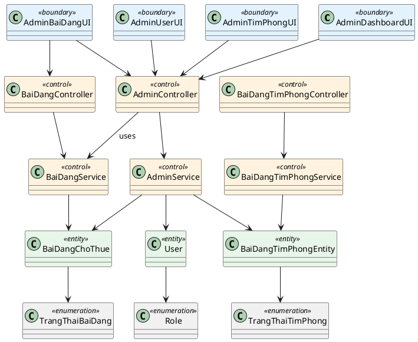
```plantuml
@startuml
skinparam classAttributeIconSize 0
skinparam class {
    BackgroundColor<<boundary>> #E3F2FD
    BackgroundColor<<control>> #FFF3E0
    BackgroundColor<<entity>> #E8F5E9
}

' === BOUNDARY ===
class AdminDashboardUI <<boundary>>
class AdminUserUI <<boundary>>
class AdminBaiDangUI <<boundary>>
class AdminTimPhongUI <<boundary>>

' === CONTROL ===
class AdminController <<control>>
class BaiDangController <<control>>
class BaiDangTimPhongController <<control>>
class AdminService <<control>>
class BaiDangService <<control>>
class BaiDangTimPhongService <<control>>

' === ENTITY ===
class User <<entity>>
class BaiDangChoThue <<entity>>
class BaiDangTimPhongEntity <<entity>>
class TrangThaiBaiDang <<enumeration>>
class TrangThaiTimPhong <<enumeration>>
class Role <<enumeration>>

' === ASSOCIATIONS ===
AdminDashboardUI --> AdminController
AdminUserUI --> AdminController
AdminBaiDangUI --> BaiDangController
AdminBaiDangUI --> AdminController
AdminTimPhongUI --> AdminController

AdminController --> AdminService
BaiDangController --> BaiDangService
BaiDangTimPhongController --> BaiDangTimPhongService
AdminController --> BaiDangService : uses

AdminService --> User
AdminService --> BaiDangChoThue
AdminService --> BaiDangTimPhongEntity
BaiDangService --> BaiDangChoThue
BaiDangTimPhongService --> BaiDangTimPhongEntity

User --> Role
BaiDangChoThue --> TrangThaiBaiDang
BaiDangTimPhongEntity --> TrangThaiTimPhong
@enduml
```

**Giải thích các lớp Boundary:**
- `AdminDashboardUI`: Giao diện màn hình tổng quan (tab Dashboard).
- `AdminUserUI`: Giao diện quản lý người dùng (danh sách, chi tiết, form cập nhật).
- `AdminBaiDangUI`: Giao diện quản lý bài đăng cho thuê (danh sách, duyệt, xóa).
- `AdminTimPhongUI`: Giao diện quản lý bài đăng tìm phòng (danh sách, xem chi tiết, xóa).

**Giải thích các lớp Control:**
- `AdminController`: Điều phối các request quản trị (`/api/admin/**`), gọi `AdminService`.
- `BaiDangController`: Điều phối các request bài đăng cho thuê (`/api/baidang/**`), gọi `BaiDangService`.
- `BaiDangTimPhongController`: Điều phối các request bài đăng tìm phòng (`/api/baidangtimphong/**`), gọi `BaiDangTimPhongService`.
- `AdminService`: Xử lý nghiệp vụ quản trị (dashboard, CRUD user, xóa bài tìm phòng).
- `BaiDangService`: Xử lý nghiệp vụ bài đăng cho thuê (lấy danh sách, duyệt, xóa).
- `BaiDangTimPhongService`: Xử lý nghiệp vụ bài đăng tìm phòng (phân trang, tìm theo ID, CRUD).

**Giải thích các lớp Entity:**
- `User`: Thực thể người dùng (id, fullname, email, role, ...).
- `BaiDangChoThue`: Thực thể bài đăng cho thuê (id, tieu_de, trangThai, ...).
- `BaiDangTimPhongEntity`: Thực thể bài đăng tìm phòng (id, tieuDe, trangThaiTimPhong, ...).
- `Role`, `TrangThaiBaiDang`, `TrangThaiTimPhong`: Các enumeration định nghĩa giá trị hợp lệ.

## 3. Mô hình động

### Sequence diagram - Pha phân tích

#### UC-ADM-01: Xem Dashboard Admin

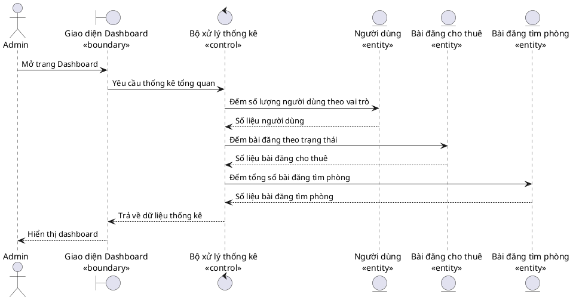
```plantuml
@startuml
actor Admin
boundary "Giao diện Dashboard\n<<boundary>>" as DashboardUI
control "Bộ xử lý thống kê\n<<control>>" as StatsControl
entity "Người dùng\n<<entity>>" as UserEntity
entity "Bài đăng cho thuê\n<<entity>>" as BaiDangEntity
entity "Bài đăng tìm phòng\n<<entity>>" as TimPhongEntity

Admin -> DashboardUI : Mở trang Dashboard
DashboardUI -> StatsControl : Yêu cầu thống kê tổng quan

StatsControl -> UserEntity : Đếm số lượng người dùng theo vai trò
UserEntity --> StatsControl : Số liệu người dùng

StatsControl -> BaiDangEntity : Đếm bài đăng theo trạng thái
BaiDangEntity --> StatsControl : Số liệu bài đăng cho thuê

StatsControl -> TimPhongEntity : Đếm tổng số bài đăng tìm phòng
TimPhongEntity --> StatsControl : Số liệu bài đăng tìm phòng

StatsControl --> DashboardUI : Trả về dữ liệu thống kê
DashboardUI --> Admin : Hiển thị dashboard
@enduml
```

#### UC-ADM-02: Quản lý người dùng (Phân quyền)

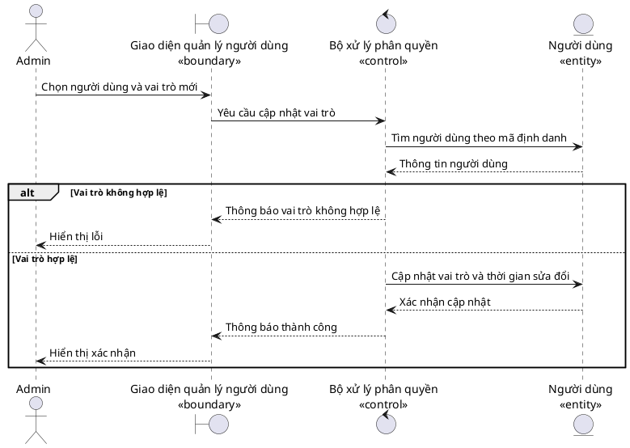
```plantuml
@startuml
actor Admin
boundary "Giao diện quản lý người dùng\n<<boundary>>" as UserUI
control "Bộ xử lý phân quyền\n<<control>>" as RoleControl
entity "Người dùng\n<<entity>>" as UserEntity

Admin -> UserUI : Chọn người dùng và vai trò mới
UserUI -> RoleControl : Yêu cầu cập nhật vai trò

RoleControl -> UserEntity : Tìm người dùng theo mã định danh
UserEntity --> RoleControl : Thông tin người dùng

alt Vai trò không hợp lệ
    RoleControl --> UserUI : Thông báo vai trò không hợp lệ
    UserUI --> Admin : Hiển thị lỗi
else Vai trò hợp lệ
    RoleControl -> UserEntity : Cập nhật vai trò và thời gian sửa đổi
    UserEntity --> RoleControl : Xác nhận cập nhật
    RoleControl --> UserUI : Thông báo thành công
    UserUI --> Admin : Hiển thị xác nhận
end
@enduml
```

#### UC-ADM-03: Duyệt bài đăng cho thuê

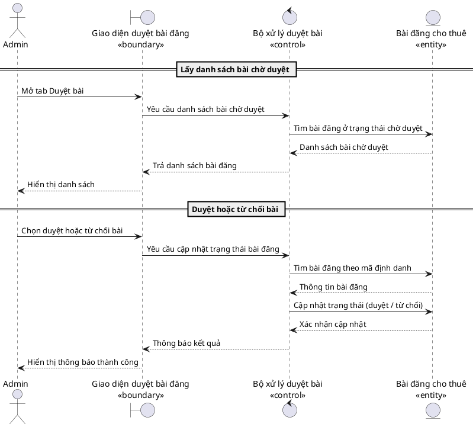
```plantuml
@startuml
actor Admin
boundary "Giao diện duyệt bài đăng\n<<boundary>>" as BaiDangUI
control "Bộ xử lý duyệt bài\n<<control>>" as ApprovalControl
entity "Bài đăng cho thuê\n<<entity>>" as BaiDangEntity

== Lấy danh sách bài chờ duyệt ==

Admin -> BaiDangUI : Mở tab Duyệt bài
BaiDangUI -> ApprovalControl : Yêu cầu danh sách bài chờ duyệt
ApprovalControl -> BaiDangEntity : Tìm bài đăng ở trạng thái chờ duyệt
BaiDangEntity --> ApprovalControl : Danh sách bài chờ duyệt
ApprovalControl --> BaiDangUI : Trả danh sách bài đăng
BaiDangUI --> Admin : Hiển thị danh sách

== Duyệt hoặc từ chối bài ==

Admin -> BaiDangUI : Chọn duyệt hoặc từ chối bài
BaiDangUI -> ApprovalControl : Yêu cầu cập nhật trạng thái bài đăng
ApprovalControl -> BaiDangEntity : Tìm bài đăng theo mã định danh
BaiDangEntity --> ApprovalControl : Thông tin bài đăng
ApprovalControl -> BaiDangEntity : Cập nhật trạng thái (duyệt / từ chối)
BaiDangEntity --> ApprovalControl : Xác nhận cập nhật
ApprovalControl --> BaiDangUI : Thông báo kết quả
BaiDangUI --> Admin : Hiển thị thông báo thành công
@enduml
```

#### UC-ADM-04: Quản lý bài đăng cho thuê (Xóa)

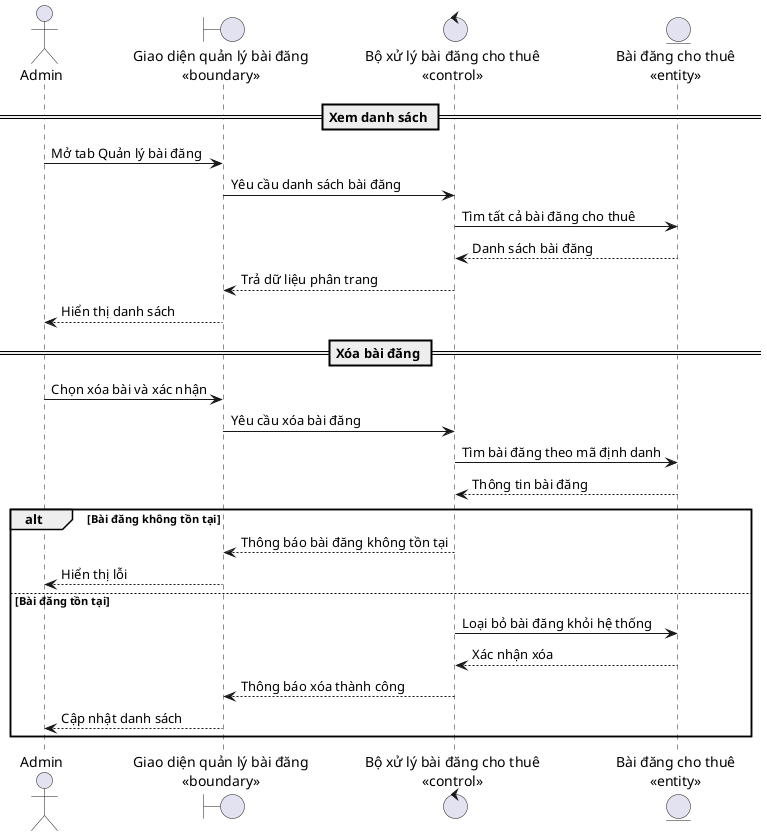
```plantuml
@startuml
actor Admin
boundary "Giao diện quản lý bài đăng\n<<boundary>>" as BaiDangUI
control "Bộ xử lý bài đăng cho thuê\n<<control>>" as PostControl
entity "Bài đăng cho thuê\n<<entity>>" as BaiDangEntity

== Xem danh sách ==

Admin -> BaiDangUI : Mở tab Quản lý bài đăng
BaiDangUI -> PostControl : Yêu cầu danh sách bài đăng
PostControl -> BaiDangEntity : Tìm tất cả bài đăng cho thuê
BaiDangEntity --> PostControl : Danh sách bài đăng
PostControl --> BaiDangUI : Trả dữ liệu phân trang
BaiDangUI --> Admin : Hiển thị danh sách

== Xóa bài đăng ==

Admin -> BaiDangUI : Chọn xóa bài và xác nhận
BaiDangUI -> PostControl : Yêu cầu xóa bài đăng
PostControl -> BaiDangEntity : Tìm bài đăng theo mã định danh
BaiDangEntity --> PostControl : Thông tin bài đăng

alt Bài đăng không tồn tại
    PostControl --> BaiDangUI : Thông báo bài đăng không tồn tại
    BaiDangUI --> Admin : Hiển thị lỗi
else Bài đăng tồn tại
    PostControl -> BaiDangEntity : Loại bỏ bài đăng khỏi hệ thống
    BaiDangEntity --> PostControl : Xác nhận xóa
    PostControl --> BaiDangUI : Thông báo xóa thành công
    BaiDangUI --> Admin : Cập nhật danh sách
end
@enduml
```

#### UC-ADM-05: Quản lý bài đăng tìm phòng

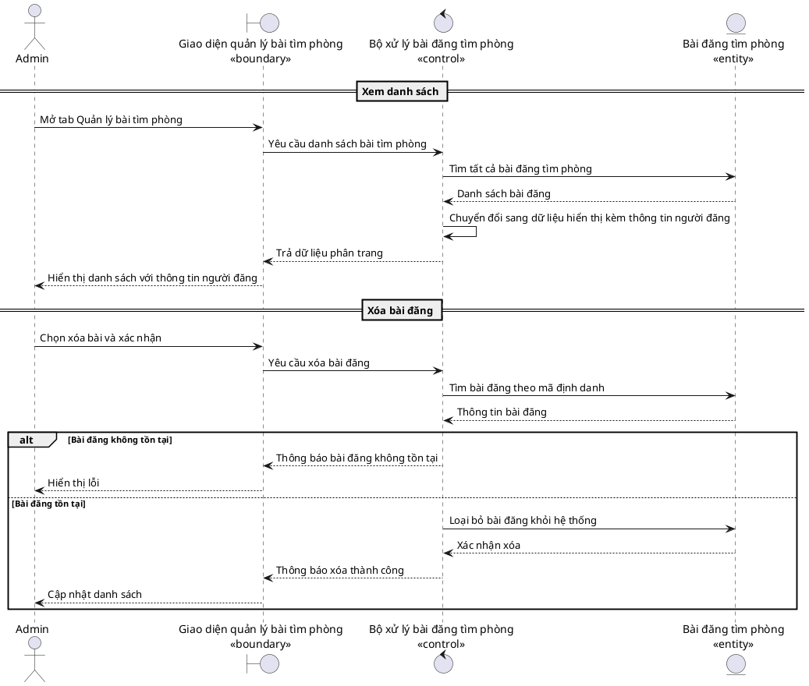
```plantuml
@startuml
actor Admin
boundary "Giao diện quản lý bài tìm phòng\n<<boundary>>" as TimPhongUI
control "Bộ xử lý bài đăng tìm phòng\n<<control>>" as TimPhongControl
entity "Bài đăng tìm phòng\n<<entity>>" as TimPhongEntity

== Xem danh sách ==

Admin -> TimPhongUI : Mở tab Quản lý bài tìm phòng
TimPhongUI -> TimPhongControl : Yêu cầu danh sách bài tìm phòng
TimPhongControl -> TimPhongEntity : Tìm tất cả bài đăng tìm phòng
TimPhongEntity --> TimPhongControl : Danh sách bài đăng
TimPhongControl -> TimPhongControl : Chuyển đổi sang dữ liệu hiển thị kèm thông tin người đăng
TimPhongControl --> TimPhongUI : Trả dữ liệu phân trang
TimPhongUI --> Admin : Hiển thị danh sách với thông tin người đăng

== Xóa bài đăng ==

Admin -> TimPhongUI : Chọn xóa bài và xác nhận
TimPhongUI -> TimPhongControl : Yêu cầu xóa bài đăng
TimPhongControl -> TimPhongEntity : Tìm bài đăng theo mã định danh
TimPhongEntity --> TimPhongControl : Thông tin bài đăng

alt Bài đăng không tồn tại
    TimPhongControl --> TimPhongUI : Thông báo bài đăng không tồn tại
    TimPhongUI --> Admin : Hiển thị lỗi
else Bài đăng tồn tại
    TimPhongControl -> TimPhongEntity : Loại bỏ bài đăng khỏi hệ thống
    TimPhongEntity --> TimPhongControl : Xác nhận xóa
    TimPhongControl --> TimPhongUI : Thông báo xóa thành công
    TimPhongUI --> Admin : Cập nhật danh sách
end
@enduml
```

### Sequence diagram - Pha thiết kế

### Sequence diagram - UC-ADM-01: Xem Dashboard Admin

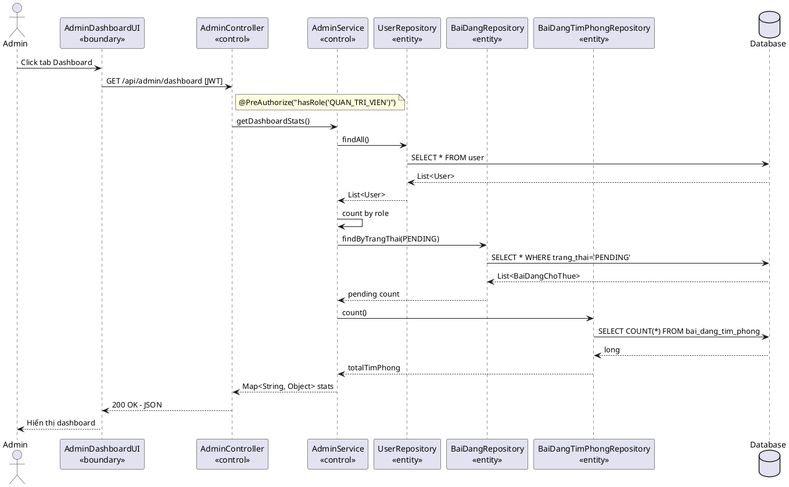
```plantuml
@startuml
actor Admin
participant "AdminDashboardUI\n<<boundary>>" as UI
participant "AdminController\n<<control>>" as Ctrl
participant "AdminService\n<<control>>" as Svc
participant "UserRepository\n<<entity>>" as UserRepo
participant "BaiDangRepository\n<<entity>>" as BDRepo
participant "BaiDangTimPhongRepository\n<<entity>>" as BDTPRepo
database "Database" as DB

Admin -> UI : Click tab Dashboard
UI -> Ctrl : GET /api/admin/dashboard [JWT]
note right of Ctrl
  @PreAuthorize("hasRole('QUAN_TRI_VIEN')")
end note
Ctrl -> Svc : getDashboardStats()

Svc -> UserRepo : findAll()
UserRepo -> DB : SELECT * FROM user
DB --> UserRepo : List<User>
UserRepo --> Svc : List<User>
Svc -> Svc : count by role

Svc -> BDRepo : findByTrangThai(PENDING)
BDRepo -> DB : SELECT * WHERE trang_thai='PENDING'
DB --> BDRepo : List<BaiDangChoThue>
BDRepo --> Svc : pending count

Svc -> BDTPRepo : count()
BDTPRepo -> DB : SELECT COUNT(*) FROM bai_dang_tim_phong
DB --> BDTPRepo : long
BDTPRepo --> Svc : totalTimPhong

Svc --> Ctrl : Map<String, Object> stats
Ctrl --> UI : 200 OK - JSON
UI --> Admin : Hiển thị dashboard
@enduml
```

### Sequence diagram - UC-ADM-02: Quản lý người dùng (Phân quyền)

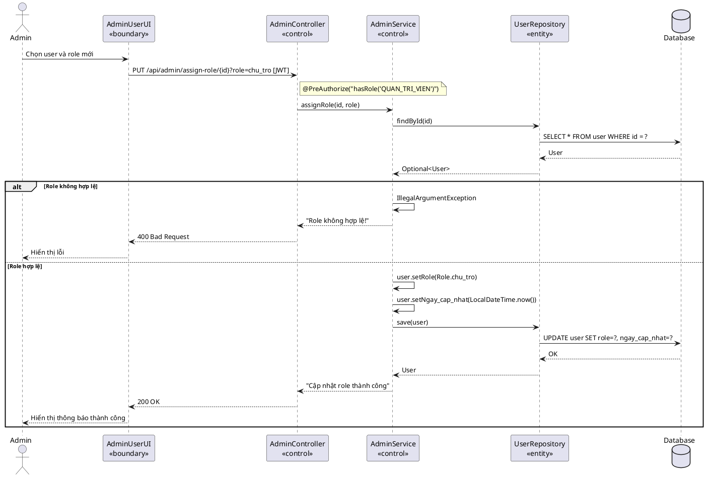
```plantuml
@startuml
actor Admin
participant "AdminUserUI\n<<boundary>>" as UI
participant "AdminController\n<<control>>" as Ctrl
participant "AdminService\n<<control>>" as Svc
participant "UserRepository\n<<entity>>" as Repo
database "Database" as DB

Admin -> UI : Chọn user và role mới
UI -> Ctrl : PUT /api/admin/assign-role/{id}?role=chu_tro [JWT]
note right of Ctrl
  @PreAuthorize("hasRole('QUAN_TRI_VIEN')")
end note
Ctrl -> Svc : assignRole(id, role)
Svc -> Repo : findById(id)
Repo -> DB : SELECT * FROM user WHERE id = ?
DB --> Repo : User
Repo --> Svc : Optional<User>

alt Role không hợp lệ
    Svc -> Svc : IllegalArgumentException
    Svc --> Ctrl : "Role không hợp lệ!"
    Ctrl --> UI : 400 Bad Request
    UI --> Admin : Hiển thị lỗi
else Role hợp lệ
    Svc -> Svc : user.setRole(Role.chu_tro)
    Svc -> Svc : user.setNgay_cap_nhat(LocalDateTime.now())
    Svc -> Repo : save(user)
    Repo -> DB : UPDATE user SET role=?, ngay_cap_nhat=?
    DB --> Repo : OK
    Repo --> Svc : User
    Svc --> Ctrl : "Cập nhật role thành công"
    Ctrl --> UI : 200 OK
    UI --> Admin : Hiển thị thông báo thành công
end
@enduml
```

### Sequence diagram - UC-ADM-03: Duyệt bài đăng cho thuê

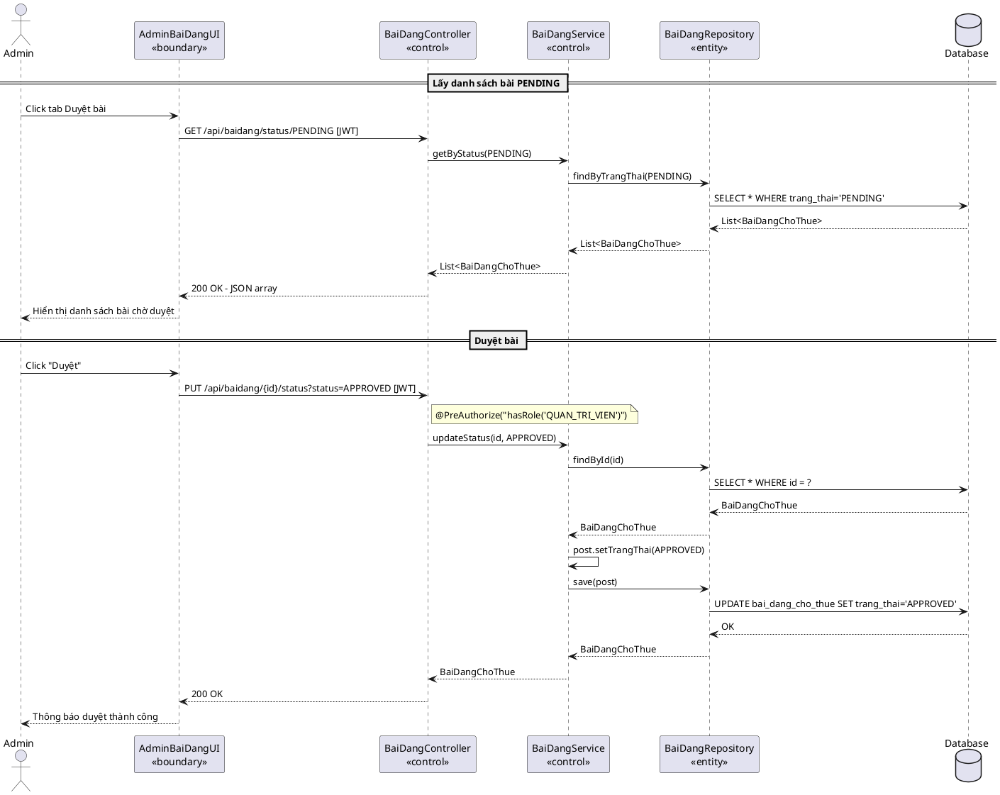
```plantuml
@startuml
actor Admin
participant "AdminBaiDangUI\n<<boundary>>" as UI
participant "BaiDangController\n<<control>>" as Ctrl
participant "BaiDangService\n<<control>>" as Svc
participant "BaiDangRepository\n<<entity>>" as Repo
database "Database" as DB

== Lấy danh sách bài PENDING ==
Admin -> UI : Click tab Duyệt bài
UI -> Ctrl : GET /api/baidang/status/PENDING [JWT]
Ctrl -> Svc : getByStatus(PENDING)
Svc -> Repo : findByTrangThai(PENDING)
Repo -> DB : SELECT * WHERE trang_thai='PENDING'
DB --> Repo : List<BaiDangChoThue>
Repo --> Svc : List<BaiDangChoThue>
Svc --> Ctrl : List<BaiDangChoThue>
Ctrl --> UI : 200 OK - JSON array
UI --> Admin : Hiển thị danh sách bài chờ duyệt

== Duyệt bài ==
Admin -> UI : Click "Duyệt"
UI -> Ctrl : PUT /api/baidang/{id}/status?status=APPROVED [JWT]
note right of Ctrl
  @PreAuthorize("hasRole('QUAN_TRI_VIEN')")
end note
Ctrl -> Svc : updateStatus(id, APPROVED)
Svc -> Repo : findById(id)
Repo -> DB : SELECT * WHERE id = ?
DB --> Repo : BaiDangChoThue
Repo --> Svc : BaiDangChoThue
Svc -> Svc : post.setTrangThai(APPROVED)
Svc -> Repo : save(post)
Repo -> DB : UPDATE bai_dang_cho_thue SET trang_thai='APPROVED'
DB --> Repo : OK
Repo --> Svc : BaiDangChoThue
Svc --> Ctrl : BaiDangChoThue
Ctrl --> UI : 200 OK
UI --> Admin : Thông báo duyệt thành công
@enduml
```

### Sequence diagram - UC-ADM-04: Quản lý bài đăng cho thuê (Xóa)

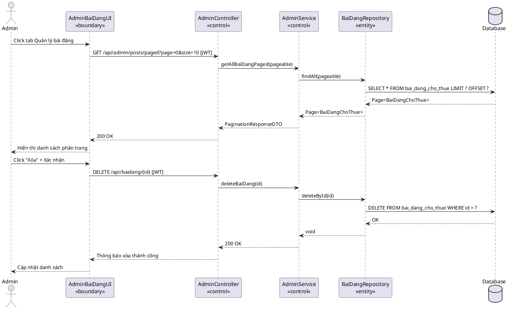
```plantuml
@startuml
actor Admin
participant "AdminBaiDangUI\n<<boundary>>" as UI
participant "AdminController\n<<control>>" as AdminCtrl
participant "AdminService\n<<control>>" as AdminSvc
participant "BaiDangRepository\n<<entity>>" as Repo
database "Database" as DB

Admin -> UI : Click tab Quản lý bài đăng
UI -> AdminCtrl : GET /api/admin/posts/paged?page=0&size=10 [JWT]
AdminCtrl -> AdminSvc : getAllBaiDangPaged(pageable)
AdminSvc -> Repo : findAll(pageable)
Repo -> DB : SELECT * FROM bai_dang_cho_thue LIMIT ? OFFSET ?
DB --> Repo : Page<BaiDangChoThue>
Repo --> AdminSvc : Page<BaiDangChoThue>
AdminSvc --> AdminCtrl : PaginationResponseDTO
AdminCtrl --> UI : 200 OK
UI --> Admin : Hiển thị danh sách phân trang

Admin -> UI : Click "Xóa" + Xác nhận
UI -> AdminCtrl : DELETE /api/baidang/{id} [JWT]
AdminCtrl -> AdminSvc : deleteBaiDang(id)
AdminSvc -> Repo : deleteById(id)
Repo -> DB : DELETE FROM bai_dang_cho_thue WHERE id = ?
DB --> Repo : OK
Repo --> AdminSvc : void
AdminSvc --> AdminCtrl : 200 OK
AdminCtrl --> UI : Thông báo xóa thành công
UI --> Admin : Cập nhật danh sách
@enduml
```

### Sequence diagram - UC-ADM-05: Quản lý bài đăng tìm phòng

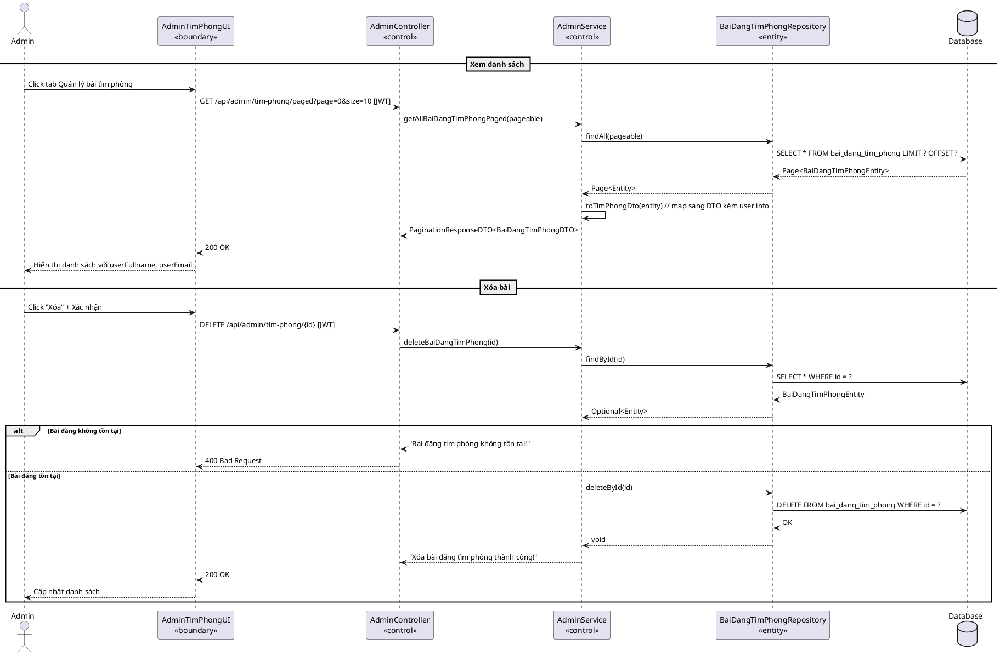
```plantuml
@startuml
actor Admin
participant "AdminTimPhongUI\n<<boundary>>" as UI
participant "AdminController\n<<control>>" as Ctrl
participant "AdminService\n<<control>>" as Svc
participant "BaiDangTimPhongRepository\n<<entity>>" as Repo
database "Database" as DB

== Xem danh sách ==
Admin -> UI : Click tab Quản lý bài tìm phòng
UI -> Ctrl : GET /api/admin/tim-phong/paged?page=0&size=10 [JWT]
Ctrl -> Svc : getAllBaiDangTimPhongPaged(pageable)
Svc -> Repo : findAll(pageable)
Repo -> DB : SELECT * FROM bai_dang_tim_phong LIMIT ? OFFSET ?
DB --> Repo : Page<BaiDangTimPhongEntity>
Repo --> Svc : Page<Entity>
Svc -> Svc : toTimPhongDto(entity) // map sang DTO kèm user info
Svc --> Ctrl : PaginationResponseDTO<BaiDangTimPhongDTO>
Ctrl --> UI : 200 OK
UI --> Admin : Hiển thị danh sách với userFullname, userEmail

== Xóa bài ==
Admin -> UI : Click "Xóa" + Xác nhận
UI -> Ctrl : DELETE /api/admin/tim-phong/{id} [JWT]
Ctrl -> Svc : deleteBaiDangTimPhong(id)
Svc -> Repo : findById(id)
Repo -> DB : SELECT * WHERE id = ?
DB --> Repo : BaiDangTimPhongEntity
Repo --> Svc : Optional<Entity>

alt Bài đăng không tồn tại
    Svc --> Ctrl : "Bài đăng tìm phòng không tồn tại!"
    Ctrl --> UI : 400 Bad Request
else Bài đăng tồn tại
    Svc -> Repo : deleteById(id)
    Repo -> DB : DELETE FROM bai_dang_tim_phong WHERE id = ?
    DB --> Repo : OK
    Repo --> Svc : void
    Svc --> Ctrl : "Xóa bài đăng tìm phòng thành công!"
    Ctrl --> UI : 200 OK
    UI --> Admin : Cập nhật danh sách
end
@enduml
```

### Activity diagram - Quy trình duyệt bài đăng

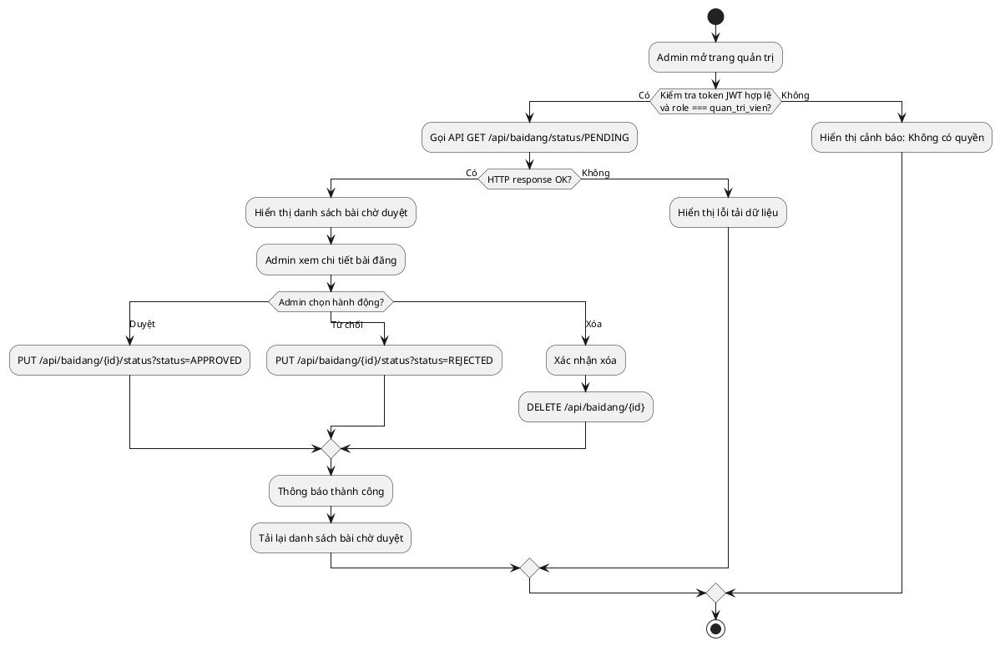
```plantuml
@startuml
start
:Admin mở trang quản trị;
if (Kiểm tra token JWT hợp lệ\nvà role === quan_tri_vien?) then (Có)
  :Gọi API GET /api/baidang/status/PENDING;
  if (HTTP response OK?) then (Có)
    :Hiển thị danh sách bài chờ duyệt;
    :Admin xem chi tiết bài đăng;
    switch (Admin chọn hành động?)
    case (Duyệt)
      :PUT /api/baidang/{id}/status?status=APPROVED;
    case (Từ chối)
      :PUT /api/baidang/{id}/status?status=REJECTED;
    case (Xóa)
      :Xác nhận xóa;
      :DELETE /api/baidang/{id};
    endswitch
    :Thông báo thành công;
    :Tải lại danh sách bài chờ duyệt;
  else (Không)
    :Hiển thị lỗi tải dữ liệu;
  endif
else (Không)
  :Hiển thị cảnh báo: Không có quyền;
endif
stop
@enduml
```

### Statechart diagram - Trạng thái bài đăng cho thuê

> **Ghi chú:** `TrangThaiBaiDang` trong source code có đúng 3 giá trị: `PENDING`, `APPROVED`, `REJECTED`. Không có trạng thái `DELETED`; việc xóa bài đăng là xóa bản ghi khỏi CSDL hoàn toàn qua `DELETE /api/baidang/{id}`.

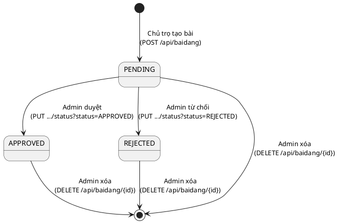
```plantuml
@startuml
[*] --> PENDING : Chủ trọ tạo bài\n(POST /api/baidang)

PENDING --> APPROVED : Admin duyệt\n(PUT .../status?status=APPROVED)
PENDING --> REJECTED : Admin từ chối\n(PUT .../status?status=REJECTED)

PENDING --> [*] : Admin xóa\n(DELETE /api/baidang/{id})
APPROVED --> [*] : Admin xóa\n(DELETE /api/baidang/{id})
REJECTED --> [*] : Admin xóa\n(DELETE /api/baidang/{id})
@enduml
```

# B. Xây dựng mới

# 1. Architectural Design

## Lựa chọn kiến trúc triển khai

Hệ thống phù hợp với kiến trúc MVC kết hợp phân lớp Service - Repository trong Spring Boot.

Các lớp chính:

- **View:** Giao diện HTML/CSS/JavaScript trong `src/main/resources/static`, ví dụ `admin.html`, `admin.js`, `admin.css`.
- **Controller:** Nhận HTTP request, kiểm tra tham số và gọi service, ví dụ `AdminController`, `BaiDangController`, `BaiDangTimPhongController`.
- **Service:** Xử lý nghiệp vụ như cập nhật trạng thái bài, tạo/xóa/cập nhật dữ liệu.
- **Repository:** Truy cập cơ sở dữ liệu qua Spring Data JPA.
- **Entity:** Ánh xạ bảng dữ liệu như `User`, `BaiDangChoThue`, `BaiDangTimPhongEntity`.
- **Database:** Lưu trữ dữ liệu hệ thống.

Ưu điểm:

- **Tách biệt trách nhiệm:** UI, điều phối request, nghiệp vụ và truy cập dữ liệu được tách rõ.
- **Dễ bảo trì:** Có thể thay đổi giao diện hoặc nghiệp vụ mà ít ảnh hưởng tới các lớp khác.
- **Dễ mở rộng:** Có thể bổ sung dashboard, thống kê, khóa tài khoản.
- **Phù hợp source code hiện tại:** Dự án đã sử dụng Spring Boot Controller/Service/Repository/Entity.

## Component/Module diagram

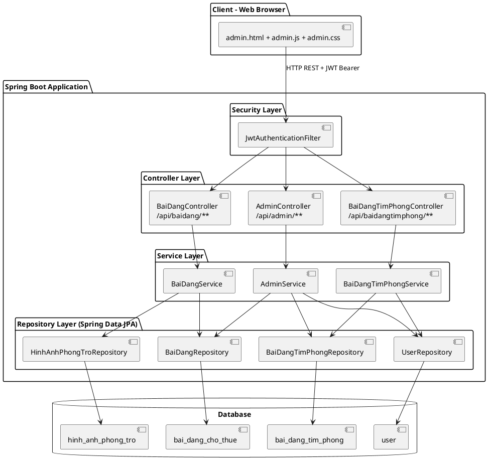
```plantuml
@startuml
package "Client - Web Browser" {
    [admin.html + admin.js + admin.css] as AdminUI
}

package "Spring Boot Application" {
    package "Security Layer" {
        [JwtAuthenticationFilter] as JwtFilter
    }

    package "Controller Layer" {
        [AdminController\n/api/admin/**] as AdminCtrl
        [BaiDangController\n/api/baidang/**] as BaiDangCtrl
        [BaiDangTimPhongController\n/api/baidangtimphong/**] as BaiDangTPCtrl
    }

    package "Service Layer" {
        [AdminService] as AdminSvc
        [BaiDangService] as BaiDangSvc
        [BaiDangTimPhongService] as BaiDangTPSvc
    }

    package "Repository Layer (Spring Data JPA)" {
        [UserRepository] as UserRepo
        [BaiDangRepository] as BaiDangRepo
        [BaiDangTimPhongRepository] as BaiDangTPRepo
        [HinhAnhPhongTroRepository] as HinhAnhRepo
    }
}

database "Database" {
    [user] as UserTbl
    [bai_dang_cho_thue] as BaiDangTbl
    [bai_dang_tim_phong] as BaiDangTPTbl
    [hinh_anh_phong_tro] as HinhAnhTbl
}

AdminUI --> JwtFilter : HTTP REST + JWT Bearer
JwtFilter --> AdminCtrl
JwtFilter --> BaiDangCtrl
JwtFilter --> BaiDangTPCtrl

AdminCtrl --> AdminSvc
BaiDangCtrl --> BaiDangSvc
BaiDangTPCtrl --> BaiDangTPSvc

AdminSvc --> UserRepo
AdminSvc --> BaiDangRepo
AdminSvc --> BaiDangTPRepo
BaiDangSvc --> BaiDangRepo
BaiDangSvc --> HinhAnhRepo
BaiDangTPSvc --> BaiDangTPRepo
BaiDangTPSvc --> UserRepo

UserRepo --> UserTbl
BaiDangRepo --> BaiDangTbl
BaiDangTPRepo --> BaiDangTPTbl
HinhAnhRepo --> HinhAnhTbl
@enduml
```

## Deployment diagram

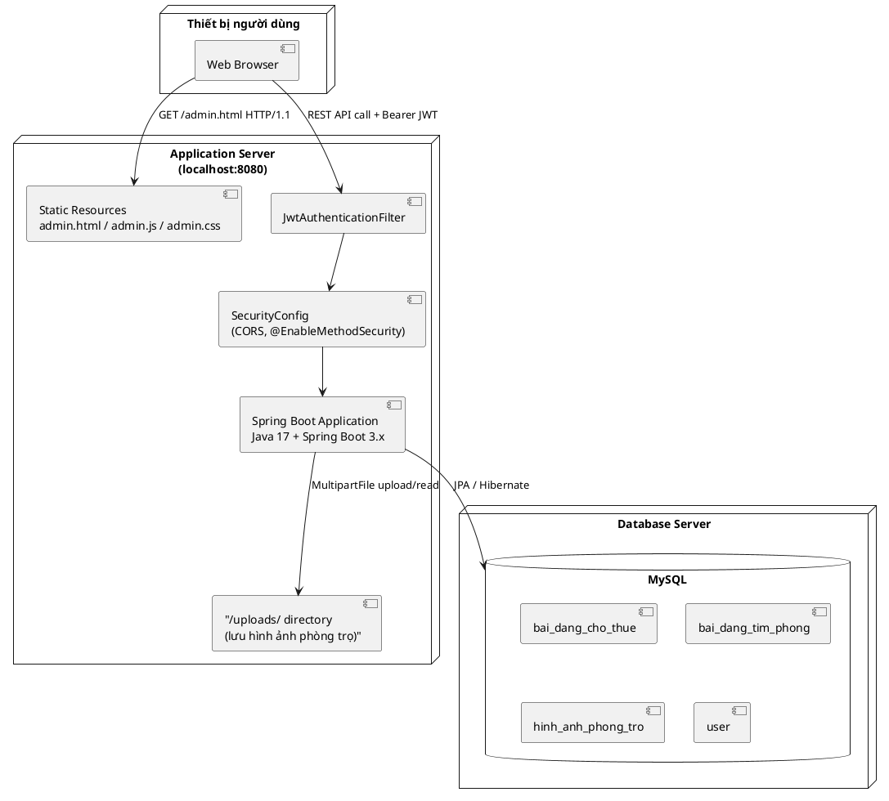
```plantuml
@startuml
node "Thiết bị người dùng" as AdminDevice {
    [Web Browser] as Browser
}

node "Application Server\n(localhost:8080)" as AppServer {
    [Static Resources\nadmin.html / admin.js / admin.css] as StaticFiles
    [Spring Boot Application\nJava 17 + Spring Boot 3.x] as SpringBootApp
    [JwtAuthenticationFilter] as JwtFilter
    [SecurityConfig\n(CORS, @EnableMethodSecurity)] as SecurityConfig
    ["/uploads/ directory\n(lưu hình ảnh phòng trọ)"] as UploadsDir
}

node "Database Server" as DBServer {
    database "MySQL" as MySQL {
        [bai_dang_cho_thue]
        [bai_dang_tim_phong]
        [hinh_anh_phong_tro]
        [user]
    }
}

Browser --> StaticFiles : GET /admin.html HTTP/1.1
Browser --> JwtFilter : REST API call + Bearer JWT
JwtFilter --> SecurityConfig
SecurityConfig --> SpringBootApp
SpringBootApp --> MySQL : JPA / Hibernate
SpringBootApp --> UploadsDir : MultipartFile upload/read
@enduml
```

# 2. Detailed Design

## Detailed class diagram

```plantuml
@startuml
skinparam classAttributeIconSize 0

' === CONTROLLERS ===
class AdminController <<RestController>> {
    -AdminService adminService
    +getDashboardStats() Map~String,Object~
    +getAllUsers() List~User~
    +getUserById(Integer id) Optional~User~
    +assignRole(Integer id, String role) String
    +updateUser(Integer id, UserDTO dto) String
    +deleteUser(Integer id) String
    +getAllPosts() List~BaiDangChoThue~
    +getAllPostsPaged(int page, int size) PaginationResponseDTO~BaiDangChoThue~
    +getAllTimPhongPaged(int page, int size) PaginationResponseDTO~BaiDangTimPhongDTO~
    +deleteTimPhong(Integer id) String
}

class BaiDangController <<RestController>> {
    -BaiDangService baiDangService
    +getAll() List~BaiDangChoThue~
    +getAllWithPagination(...) PaginationResponseDTO
    +getById(Integer id) Optional~BaiDangChoThue~
    +create(BaiDangChoThue baiDang) BaiDangChoThue
    +updateStatus(Integer id, TrangThaiBaiDang status) BaiDangChoThue
    +getByStatus(String status) List~BaiDangChoThue~
    +delete(Integer id) void
}

class BaiDangTimPhongController <<RestController>> {
    -BaiDangTimPhongService baiDangTimPhongService
    +getAllWithPagination(...) ResponseEntity
    +findByPostId(Integer id) ResponseEntity
    +createPost(BaiDangTimPhongDTO dto, BindingResult result) ResponseEntity
    +deletePost(Integer id) ResponseEntity
    +updatePost(Integer id, BaiDangTimPhongDTO dto, BindingResult result) ResponseEntity
}

' === SERVICES ===
class AdminService <<Service>> {
    -UserRepository userRepository
    -PasswordEncoder passwordEncoder
    -BaiDangRepository baiDangRepository
    -BaiDangTimPhongRepository baiDangTimPhongRepository
    +getDashboardStats() Map~String,Object~
    +getAllUsers() List~User~
    +getUserById(Integer id) Optional~User~
    +assignRole(Integer id, String role) String
    +updateUser(Integer id, UserDTO dto) String
    +deleteUser(Integer id) String
    +getAllBaiDang() List~BaiDangChoThue~
    +getAllBaiDangPaged(Pageable pageable) PaginationResponseDTO~BaiDangChoThue~
    +getAllBaiDangTimPhongPaged(Pageable pageable) PaginationResponseDTO~BaiDangTimPhongDTO~
    +deleteBaiDangTimPhong(Integer id) String
    -toTimPhongDto(BaiDangTimPhongEntity entity) BaiDangTimPhongDTO
}

class BaiDangService <<Service>> {
    -BaiDangRepository baiDangRepository
    -HinhAnhPhongTroRepository hinhAnhRepository
    -GeocodingService geocodingService
    +getAllBaiDang() List~BaiDangChoThue~
    +getAllBaiDangWithPagination(...) PaginationResponseDTO
    +getBaiDangById(Integer id) Optional~BaiDangChoThue~
    +saveBaiDang(BaiDangChoThue baiDang) BaiDangChoThue
    +updateStatus(Integer id, TrangThaiBaiDang status) BaiDangChoThue
    +getByStatus(TrangThaiBaiDang status) List~BaiDangChoThue~
    +deleteBaiDang(Integer id) void
    +updateBaiDang(Integer id, BaiDangChoThue updatedBaiDang) BaiDangChoThue
    +geocodeBaiDang(Integer id) GeocodeResponseDTO
    -buildFullAddress(BaiDangChoThue baiDang) String
}

class BaiDangTimPhongService <<Service>> {
    -BaiDangTimPhongRepository baiDangTimPhongRepository
    -UserRepository userRepository
    +getAllBaiDangTimPhongWithPagination(...) PaginationResponseDTO
    +findById(Integer id) Optional~BaiDangTimPhongDTO~
    +createPost(BaiDangTimPhongDTO dto) void
    +updatePost(Integer id, BaiDangTimPhongDTO dto) void
    +deletePost(Integer id) void
    -toDto(BaiDangTimPhongEntity entity) BaiDangTimPhongDTO
}

' === REPOSITORIES ===
class UserRepository <<Repository>> {
    +findByEmail(String email) User
    +findById(Integer id) Optional~User~
    +findAll() List~User~
    +save(User user) User
    +deleteById(Integer id) void
}

class BaiDangRepository <<Repository>> {
    +findByTrangThai(TrangThaiBaiDang status) List~BaiDangChoThue~
    +findWithFilters(...) List~BaiDangChoThue~
    +countWithFilters(...) long
    +findByGiaThangBetween(Double costMin, Double costMax) List~BaiDangChoThue~
    +findById(Integer id) Optional~BaiDangChoThue~
    +findAll() List~BaiDangChoThue~
    +findAll(Pageable pageable) Page~BaiDangChoThue~
    +save(BaiDangChoThue baiDang) BaiDangChoThue
    +deleteById(Integer id) void
    +count() long
}

class BaiDangTimPhongRepository <<Repository>> {
    +findByIdWithUser(Integer id) Optional~BaiDangTimPhongEntity~
    +findWithFilters(...) List~BaiDangTimPhongEntity~
    +countWithFilters(...) long
    +findAll() List~BaiDangTimPhongEntity~
    +findAll(Pageable pageable) Page~BaiDangTimPhongEntity~
    +findById(Integer id) Optional~BaiDangTimPhongEntity~
    +save(BaiDangTimPhongEntity entity) BaiDangTimPhongEntity
    +deleteById(Integer id) void
    +existsById(Integer id) boolean
    +count() long
}

' === ENTITIES ===
class User <<Entity>> {
    +Integer id
    +String fullname
    +String email
    +String so_dien_thoai
    -String hash_password
    +String avatar
    +Role role
    +LocalDateTime ngay_tao
    +LocalDateTime ngay_cap_nhat
    +getAuthorities() Collection~GrantedAuthority~
}

class BaiDangChoThue <<Entity>> {
    +Integer id
    +User nguoiDang
    +String tieu_de
    +String mo_ta
    +String dia_chi_day_du
    +String phuong_xa
    +String tinh_thanhpho
    +Double vi_do
    +Double kinh_do
    +Double gia_thang
    +Float dien_tich_m2
    +TrangThaiBaiDang trangThai
    +LocalDateTime ngay_co_the_vao_o
    +LocalDateTime ngay_dang
    +LocalDateTime ngay_cap_nhat
    +List~HinhAnhPhongTro~ hinhAnhPhongTro
}

class BaiDangTimPhongEntity <<Entity>> {
    +Integer id
    +User user
    +String tieuDe
    +String moTa
    +String khuVucMongMuonXa
    +String khuVucMongMuonThanhPho
    +BigDecimal giaThapNhat
    +BigDecimal giaCaoNhat
    +Float dienTichToiThieu
    +Integer soNguoiO
    +TrangThaiTimPhong trangThaiTimPhong
    +Timestamp ngayDang
    +Timestamp ngayCapNhat
}

' === DTOs ===
class UserDTO <<DTO>> {
    +Integer id
    +String email
    +String password
    +String fullname
    +String soDienThoai
    +String role
    +String avatar
}

class BaiDangTimPhongDTO <<DTO>> {
    +Integer id
    +Integer userId
    +String tieuDe
    +String moTa
    +String khuVucMongMuonXa
    +String khuVucMongMuonThanhPho
    +BigDecimal giaThapNhat
    +BigDecimal giaCaoNhat
    +Float dienTichToiThieu
    +Integer soNguoiO
    +String trangThai
    +String userFullname
    +String userEmail
    +String userSoDienThoai
}

class PaginationResponseDTO~T~ <<DTO>> {
    +boolean success
    +List~T~ data
    +int currentPage
    +int pageSize
    +long totalElements
    +int totalPages
    +String message
}

' === ENUMS ===
enum Role <<enumeration>> {
    nguoi_thue
    chu_tro
    quan_tri_vien
}

enum TrangThaiBaiDang <<enumeration>> {
    PENDING
    APPROVED
    REJECTED
}

enum TrangThaiTimPhong <<enumeration>> {
    dang_tim
    da_tim_duoc
}

' === ASSOCIATIONS & DEPENDENCIES ===
AdminController --> AdminService
BaiDangController --> BaiDangService
BaiDangTimPhongController --> BaiDangTimPhongService

AdminService --> UserRepository
AdminService --> BaiDangRepository
AdminService --> BaiDangTimPhongRepository
BaiDangService --> BaiDangRepository
BaiDangTimPhongService --> BaiDangTimPhongRepository
BaiDangTimPhongService --> UserRepository

User --> Role
BaiDangChoThue --> TrangThaiBaiDang
BaiDangTimPhongEntity --> TrangThaiTimPhong
BaiDangChoThue --> User : nguoiDang
BaiDangTimPhongEntity --> User : user
@enduml
```

> **Ghi chú cập nhật so với bản cũ:**
> - Bổ sung `AdminService` (trước đây thiếu trong design class diagram).
> - `AdminController` không còn `UserRepository` và `BCryptPasswordEncoder` trực tiếp; giờ inject `AdminService` thông qua constructor.
> - `AdminService` chứa đầy đủ các repository cần thiết: `UserRepository`, `BaiDangRepository`, `BaiDangTimPhongRepository`, `PasswordEncoder`.
> - Cập nhật method signatures của `BaiDangController` (bỏ param `String role` trong `updateStatus`, bổ sung `getByStatus(String status)` thay vì `TrangThaiBaiDang`).
> - Bổ sung `BaiDangTimPhongDTO` với các trường `userFullname`, `userEmail`, `userSoDienThoai` để hiển thị thông tin người đăng trong admin panel.

## ERD

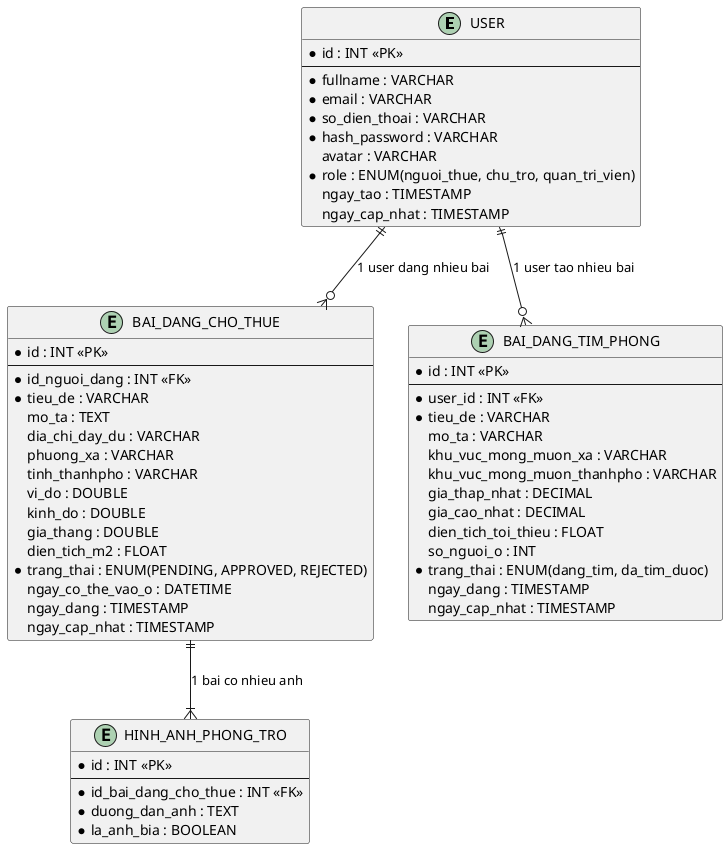
```plantuml
@startuml
entity "USER" as USER {
    * id : INT <<PK>>
    --
    * fullname : VARCHAR
    * email : VARCHAR
    * so_dien_thoai : VARCHAR
    * hash_password : VARCHAR
    avatar : VARCHAR
    * role : ENUM(nguoi_thue, chu_tro, quan_tri_vien)
    ngay_tao : TIMESTAMP
    ngay_cap_nhat : TIMESTAMP
}

entity "BAI_DANG_CHO_THUE" as BDCT {
    * id : INT <<PK>>
    --
    * id_nguoi_dang : INT <<FK>>
    * tieu_de : VARCHAR
    mo_ta : TEXT
    dia_chi_day_du : VARCHAR
    phuong_xa : VARCHAR
    tinh_thanhpho : VARCHAR
    vi_do : DOUBLE
    kinh_do : DOUBLE
    gia_thang : DOUBLE
    dien_tich_m2 : FLOAT
    * trang_thai : ENUM(PENDING, APPROVED, REJECTED)
    ngay_co_the_vao_o : DATETIME
    ngay_dang : TIMESTAMP
    ngay_cap_nhat : TIMESTAMP
}

entity "BAI_DANG_TIM_PHONG" as BDTP {
    * id : INT <<PK>>
    --
    * user_id : INT <<FK>>
    * tieu_de : VARCHAR
    mo_ta : VARCHAR
    khu_vuc_mong_muon_xa : VARCHAR
    khu_vuc_mong_muon_thanhpho : VARCHAR
    gia_thap_nhat : DECIMAL
    gia_cao_nhat : DECIMAL
    dien_tich_toi_thieu : FLOAT
    so_nguoi_o : INT
    * trang_thai : ENUM(dang_tim, da_tim_duoc)
    ngay_dang : TIMESTAMP
    ngay_cap_nhat : TIMESTAMP
}

entity "HINH_ANH_PHONG_TRO" as HAPT {
    * id : INT <<PK>>
    --
    * id_bai_dang_cho_thue : INT <<FK>>
    * duong_dan_anh : TEXT
    * la_anh_bia : BOOLEAN
}

USER ||--o{ BDCT : "1 user dang nhieu bai"
USER ||--o{ BDTP : "1 user tao nhieu bai"
BDCT ||--|{ HAPT : "1 bai co nhieu anh"
@enduml
```

## Test case

| TC ID | Chức năng | Tiền điều kiện | Dữ liệu kiểm thử | Các bước thực hiện | Kết quả mong đợi | Độ ưu tiên |
|---|---|---|---|---|---|---|
| TC-ADM-01 | Truy cập trang Admin | User chưa đăng nhập | Không có token | Mở `/admin.html` | Hiển thị thông báo không có quyền | Cao |
| TC-ADM-02 | Truy cập trang Admin | User có role `nguoi_thue` | Token hợp lệ nhưng role không phải admin | Mở `/admin.html` | Hiển thị thông báo không có quyền | Cao |
| TC-ADM-03 | Truy cập trang Admin | User có role `quan_tri_vien` | Token admin hợp lệ | Mở `/admin.html` | Hiển thị nội dung quản trị | Cao |
| TC-ADM-04 | Xem danh sách user | Admin đã đăng nhập | Gọi `GET /api/admin/users` | Gửi request kèm JWT | Trả về danh sách user | Cao |
| TC-ADM-05 | Xem chi tiết user | User tồn tại | id = 1 | Gọi `GET /api/admin/users/1` | Trả về thông tin user | Cao |
| TC-ADM-06 | Xem chi tiết user không tồn tại | User không tồn tại | id không có trong DB | Gọi API chi tiết | Trả về rỗng hoặc thông báo không tồn tại | Trung bình |
| TC-ADM-07 | Phân quyền user hợp lệ | User tồn tại | role = `chu_tro` | Gọi `PUT /api/admin/assign-role/{id}` | Role được cập nhật thành công | Cao |
| TC-ADM-08 | Phân quyền user không hợp lệ | User tồn tại | role = `admin_fake` | Gọi API phân quyền | Hệ thống báo role không hợp lệ | Cao |
| TC-ADM-09 | Cập nhật thông tin user | User tồn tại | fullname, email, phone mới | Gọi `PUT /api/admin/update-user/{id}` | User được cập nhật | Cao |
| TC-ADM-10 | Xem bài chờ duyệt | Có bài `PENDING` | status = `PENDING` | Gọi `GET /api/baidang/status/PENDING` | Trả về danh sách bài chờ duyệt | Cao |
| TC-ADM-11 | Duyệt bài cho thuê | Bài tồn tại ở trạng thái `PENDING` | status = `APPROVED`, role = `ADMIN` | Gọi `PUT /api/baidang/{id}/status` | Bài chuyển sang `APPROVED` | Cao |
| TC-ADM-12 | Từ chối bài cho thuê | Bài tồn tại | status = `REJECTED`, role = `ADMIN` | Gọi API cập nhật trạng thái | Bài chuyển sang `REJECTED` | Cao |
| TC-ADM-13 | Xóa bài cho thuê | Bài tồn tại | id bài đăng | Gọi `DELETE /api/baidang/{id}` | Bài bị xóa khỏi hệ thống | Cao |
| TC-ADM-14 | Xem bài tìm phòng | Có dữ liệu bài tìm phòng | page, size | Gọi `GET /api/baidangtimphong/` | Trả về danh sách phân trang | Cao |
| TC-ADM-15 | Xóa bài tìm phòng | Bài tìm phòng tồn tại | id bài | Gọi `DELETE /api/baidangtimphong/{id}` | Bài bị xóa | Cao |
| TC-ADM-16 | Xem dashboard | Có dữ liệu hệ thống | Token admin | Gọi `GET /api/admin/dashboard` | Hiển thị tổng số user, bài đăng | Trung bình |

# Đối chiếu source code hiện tại

## Đã triển khai

| Chức năng | Class/File | Endpoint |
|---|---|---|
| Xem Dashboard | `AdminController` | `GET /api/admin/dashboard` |
| Xem danh sách user | `AdminController` | `GET /api/admin/users` |
| Xem chi tiết user | `AdminController` | `GET /api/admin/users/{id}` |
| Phân quyền user | `AdminController` | `PUT /api/admin/assign-role/{id}` |
| Cập nhật thông tin user | `AdminController` | `PUT /api/admin/update-user/{id}` |
| Xóa user | `AdminController` | `DELETE /api/admin/delete-user/{id}` |
| Xem tất cả bài đăng cho thuê (admin) | `AdminController` | `GET /api/admin/posts` / `GET /api/admin/posts/paged` |
| Xem bài đăng theo trạng thái | `BaiDangController` | `GET /api/baidang/status/{status}` _(PENDING chỉ admin được xem)_ |
| Duyệt / Từ chối bài | `BaiDangController` | `PUT /api/baidang/{id}/status?status=...` _(có `@PreAuthorize("hasRole('QUAN_TRI_VIEN')")`)_ |
| Xóa bài cho thuê | `BaiDangController` | `DELETE /api/baidang/{id}` _(admin hoặc chủ bài)_ |
| Xem danh sách bài tìm phòng (admin) | `AdminController` | `GET /api/admin/tim-phong/paged` |
| Xóa bài tìm phòng (admin) | `AdminController` | `DELETE /api/admin/tim-phong/{id}` |
| Xem bài tìm phòng (public) | `BaiDangTimPhongController` | `GET /api/baidangtimphong/` |
| Xóa bài tìm phòng (public) | `BaiDangTimPhongController` | `DELETE /api/baidangtimphong/{id}` |

## Cần bổ sung để hoàn thiện yêu cầu

| Yêu cầu | Mô tả bổ sung cần thiết |
|---|---|
| Vô hiệu hóa / kích hoạt tài khoản | Thêm trường `boolean enabled` vào entity `User`, thêm endpoint `PUT /api/admin/toggle-user/{id}` |
