# Tài liệu Phân tích và Thiết kế
## Nhóm chức năng 5: Quản trị hệ thống (Admin)

## A. Cập nhật phần đã có

# I. Mô tả hệ thống

## 1. Mô tả chung về hệ thống, lý do lựa chọn

Hệ thống Room Finding And Rental System là phần mềm hỗ trợ kết nối giữa người có nhu cầu thuê phòng, chủ trọ và bộ phận quản trị. Hệ thống cho phép người dùng đăng ký, đăng nhập, tìm kiếm phòng trọ, đăng bài cho thuê, đăng bài tìm phòng, bình luận và quản lý thông tin cá nhân.

Trong phạm vi nhóm chức năng quản trị hệ thống, Admin chịu trách nhiệm kiểm soát dữ liệu, duyệt nội dung và đảm bảo môi trường sử dụng an toàn, minh bạch. Các chức năng quản trị bao gồm quản lý người dùng, quản lý bài đăng cho thuê, quản lý bài đăng tìm phòng, quản lý bình luận và theo dõi tổng quan hệ thống qua dashboard.

Lý do lựa chọn nhóm chức năng Admin:

- **Đảm bảo chất lượng nội dung:** Bài đăng cần được kiểm duyệt để tránh thông tin sai lệch, spam hoặc nội dung vi phạm.
- **Đảm bảo an toàn người dùng:** Admin có thể quản lý vai trò, cập nhật thông tin và xử lý tài khoản không phù hợp.
- **Hỗ trợ vận hành hệ thống:** Dashboard giúp theo dõi số lượng người dùng, bài đăng, bình luận và hoạt động gần đây.
- **Tăng độ tin cậy của nền tảng:** Một hệ thống cho thuê phòng cần cơ chế quản trị để duy trì tính minh bạch và tin cậy.

## 2. Khảo sát hệ thống tương tự

Một số hệ thống tương tự trên thị trường:

| Hệ thống | Chức năng liên quan | Nhận xét |
|---|---|---|
| Chotot Nhà | Quản lý tin đăng, kiểm duyệt tin, lọc tin vi phạm | Có quy trình duyệt nội dung trước/sau khi hiển thị |
| Batdongsan.com.vn | Quản lý tài khoản, tin đăng, trạng thái hiển thị | Phân quyền rõ giữa người đăng tin và bộ phận kiểm duyệt |
| Airbnb | Quản lý người dùng, đánh giá, bình luận, báo cáo vi phạm | Tập trung mạnh vào uy tín người dùng và kiểm soát nội dung |
| Facebook Marketplace | Quản lý bài đăng, báo cáo spam, xóa nội dung vi phạm | Phụ thuộc nhiều vào báo cáo cộng đồng và thuật toán lọc |

Qua khảo sát, các hệ thống đều cần vai trò quản trị để kiểm soát tài khoản, bài đăng và bình luận. Vì vậy, nhóm chức năng Admin là thành phần quan trọng trong hệ thống tìm và cho thuê phòng.

# II. Thu thập yêu cầu

## 1. Bảng thuật ngữ

| Thuật ngữ | Ý nghĩa |
|---|---|
| Admin / Quản trị viên | Người có quyền quản lý toàn bộ dữ liệu và nội dung trong hệ thống |
| User / Người dùng | Tài khoản sử dụng hệ thống, có thể là người thuê, chủ trọ hoặc quản trị viên |
| Người thuê | Người tìm phòng hoặc đăng bài tìm phòng |
| Chủ trọ | Người đăng bài cho thuê phòng |
| Bài đăng cho thuê | Bài viết mô tả phòng trọ cho thuê, gồm giá, diện tích, địa chỉ, hình ảnh, trạng thái |
| Bài đăng tìm phòng | Bài viết thể hiện nhu cầu tìm phòng của người thuê |
| Bình luận | Nội dung phản hồi của người dùng trên bài đăng cho thuê hoặc bài đăng tìm phòng |
| Trạng thái bài đăng | Tình trạng xử lý của bài đăng, ví dụ: PENDING, APPROVED, REJECTED |
| Phân quyền | Việc gán vai trò cho user: nguoi_thue, chu_tro, quan_tri_vien |
| Dashboard | Màn hình tổng quan số liệu hệ thống dành cho Admin |
| Vô hiệu hóa tài khoản | Tạm khóa tài khoản để ngăn người dùng tiếp tục sử dụng hệ thống |
| Kích hoạt tài khoản | Mở lại tài khoản đã bị vô hiệu hóa |

## 2. Mô hình nghiệp vụ bằng ngôn ngữ tự nhiên

### Mục tiêu và phạm vi hệ thống

Mục tiêu của nhóm chức năng Admin là hỗ trợ quản trị viên kiểm soát người dùng, bài đăng, bình luận và theo dõi tình hình hoạt động tổng quan của hệ thống.

Phạm vi bao gồm:

- Quản lý thông tin và vai trò người dùng.
- Duyệt, xóa và thống kê bài đăng cho thuê.
- Xóa và thống kê bài đăng tìm phòng.
- Xem, ẩn/hiện, xóa và lọc bình luận.
- Hiển thị dashboard tổng quan hệ thống.

### Ai có thể sử dụng phần mềm?

Trong phạm vi nhóm quản trị, người sử dụng chính là Admin. Admin phải đăng nhập thành công và có vai trò `quan_tri_vien`. Hệ thống hiện có cơ chế bảo vệ endpoint `/api/admin` bằng phân quyền Spring Security `hasRole('QUAN_TRI_VIEN')`.

Các đối tượng liên quan khác:

- **Người thuê:** Tạo bài tìm phòng, bình luận, xem bài đăng.
- **Chủ trọ:** Tạo bài cho thuê, quản lý bài của mình, nhận bình luận.
- **Khách chưa đăng nhập:** Có thể xem một số thông tin công khai tùy cấu hình hệ thống.

### Người dùng có những chức năng gì?

Admin có các nhóm chức năng:

- **Quản lý người dùng:** Xem danh sách user, xem chi tiết, phân quyền, cập nhật thông tin, vô hiệu hóa/kích hoạt tài khoản.
- **Quản lý bài đăng cho thuê:** Xem tất cả bài đăng, duyệt bài, xóa bài vi phạm, thống kê bài theo trạng thái.
- **Quản lý bài đăng tìm phòng:** Xem tất cả bài tìm phòng, xóa bài vi phạm, thống kê số lượng bài tìm phòng.
- **Quản lý bình luận:** Xem tất cả bình luận, ẩn/hiện bình luận, xóa bình luận vi phạm, xem bình luận theo bài đăng hoặc người dùng.
- **Dashboard Admin:** Xem số lượng user theo role, số lượng bài đăng theo trạng thái, số lượng bình luận và hoạt động gần đây.

### Mỗi chức năng hoạt động ra sao?

#### Quản lý người dùng

Admin truy cập trang quản trị, hệ thống kiểm tra token và role. Nếu hợp lệ, Admin có thể lấy danh sách user. Khi xem chi tiết, hệ thống hiển thị id, email, role, ngày tạo và các thông tin liên quan. Admin có thể cập nhật thông tin hoặc gán role mới. Khi thay đổi role, hệ thống kiểm tra role hợp lệ rồi lưu vào cơ sở dữ liệu.

Trong source code hiện tại, phần quản lý user đã có các endpoint chính trong `AdminController`:

- `GET /api/admin/users`
- `GET /api/admin/users/{id}`
- `PUT /api/admin/assign-role/{id}`
- `PUT /api/admin/update-user/{id}`
- `DELETE /api/admin/delete-user/{id}`

Chức năng vô hiệu hóa/kích hoạt tài khoản là yêu cầu nghiệp vụ cần bổ sung trường trạng thái tài khoản nếu triển khai đầy đủ.

#### Quản lý bài đăng cho thuê

Admin xem danh sách bài đăng cho thuê. Bài mới thường có trạng thái `PENDING`. Admin xem chi tiết bài, kiểm tra nội dung, hình ảnh, địa chỉ, giá và thông tin người đăng. Nếu hợp lệ, Admin duyệt bài sang `APPROVED`. Nếu không hợp lệ, Admin từ chối hoặc xóa bài.

Source code hiện tại có:

- `GET /api/baidang/all`
- `GET /api/baidang/status/{status}`
- `GET /api/baidang/{id}`
- `PUT /api/baidang/{id}/status?status=...&role=ADMIN`
- `DELETE /api/baidang/{id}`

Giao diện `admin.html` và `admin.js` hiện tập trung vào quản lý bài đăng chờ duyệt.

#### Quản lý bài đăng tìm phòng

Admin xem danh sách bài đăng tìm phòng, lọc theo khu vực, giá, diện tích hoặc trạng thái nếu có. Khi phát hiện nội dung vi phạm, Admin xóa bài. Hệ thống cập nhật lại danh sách và thống kê.

Source code hiện tại có:

- `GET /api/baidangtimphong/`
- `GET /api/baidangtimphong/{id}`
- `DELETE /api/baidangtimphong/{id}`
- `PUT /api/baidangtimphong/{id}`

#### Quản lý bình luận

Admin xem bình luận của bài đăng cho thuê hoặc bài đăng tìm phòng. Nếu bình luận spam, chứa ngôn từ không phù hợp hoặc vi phạm quy định, Admin có thể xóa hoặc ẩn bình luận. Yêu cầu ẩn/hiện cần trường `hienThi`; trong source code hiện tại, entity bình luận chưa có trường này nên đây là phần cần bổ sung nếu triển khai đầy đủ.

Source code hiện tại có:

- `GET /api/bai-dang-cho-thue/{id}/binh-luan`
- `DELETE /api/bai-dang-cho-thue/binh-luan/{id}`
- `GET /api/bai-dang-tim-phong/{id}/binh-luan`
- `DELETE /api/bai-dang-tim-phong/binh-luan/{id}`

#### Dashboard Admin

Dashboard tổng hợp dữ liệu từ các module:

- Số lượng user theo role.
- Số lượng bài đăng cho thuê theo trạng thái.
- Số lượng bài tìm phòng.
- Số lượng bình luận.
- Hoạt động gần đây như user mới, bài mới, bình luận mới, bài vừa được duyệt/xóa.

Trong source code hiện tại, dashboard tổng hợp chưa có endpoint riêng. Có thể xây dựng bằng service tổng hợp từ các repository hiện có.

### Những thông tin/đối tượng mà hệ thống cần xử lý

- User
- Vai trò người dùng
- Bài đăng cho thuê
- Bài đăng tìm phòng
- Hình ảnh phòng trọ
- Bình luận bài cho thuê
- Bình luận bài tìm phòng
- Trạng thái bài đăng
- Thống kê hệ thống
- Hoạt động gần đây

### Quan hệ giữa các đối tượng

- Một User có thể tạo nhiều bài đăng cho thuê.
- Một User có thể tạo nhiều bài đăng tìm phòng.
- Một User có thể viết nhiều bình luận.
- Một bài đăng cho thuê có nhiều hình ảnh.
- Một bài đăng cho thuê có nhiều bình luận cho thuê.
- Một bài đăng tìm phòng có nhiều bình luận tìm phòng.
- Một bình luận có thể có nhiều bình luận con.
- Admin là User có role `quan_tri_vien` và có quyền quản lý các đối tượng trên.

## 3. Mô hình nghiệp vụ bằng UML

### Xác định các actor của hệ thống

Các actor trong phạm vi Admin:

- **Admin:** Tác nhân chính, thực hiện toàn bộ chức năng quản trị.
- **Hệ thống xác thực:** Kiểm tra token, role và quyền truy cập.
- **Người dùng:** Đối tượng bị quản lý.
- **Chủ trọ:** Người tạo bài cho thuê, chịu ảnh hưởng bởi duyệt/xóa bài.
- **Người thuê:** Người tạo bài tìm phòng hoặc bình luận, chịu ảnh hưởng bởi quản lý nội dung.

### Use case cho từng actor

> **Ghi chú:** Mermaid không hỗ trợ cú pháp use case diagram chuẩn UML. Sơ đồ dưới đây mô phỏng cấu trúc use case theo ký pháp UML bằng `flowchart`, trong đó actor được ký hiệu `([...])` và use case được ký hiệu `([...])` bên trong vùng hệ thống.

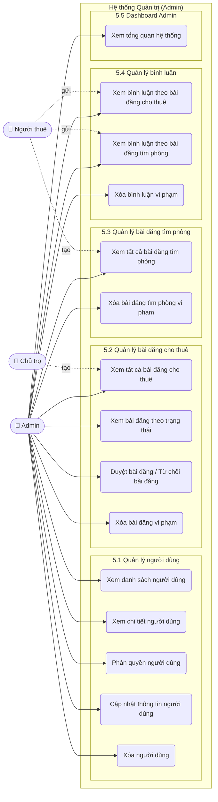

## 4. Bảng yêu cầu người dùng

| ID | Mô tả yêu cầu | Độ ưu tiên |
|---|---|---|
| ADM-01 | Admin có thể đăng nhập và truy cập trang quản trị khi có role `quan_tri_vien` | Cao |
| ADM-02 | Admin có thể xem danh sách tất cả người dùng | Cao |
| ADM-03 | Admin có thể xem chi tiết user gồm id, email, role, ngày tạo | Cao |
| ADM-04 | Admin có thể phân quyền user | Cao |
| ADM-05 | Admin có thể cập nhật thông tin user | Cao |
| ADM-06 | Admin có thể vô hiệu hóa hoặc kích hoạt tài khoản _(yêu cầu bổ sung trường `enabled` vào entity `User`)_ | Thấp |
| ADM-07 | Admin có thể xem tất cả bài đăng cho thuê | Cao |
| ADM-08 | Admin có thể duyệt bài đăng cho thuê | Cao |
| ADM-09 | Admin có thể xóa bài đăng cho thuê vi phạm/spam | Cao |
| ADM-10 | Admin có thể xem thống kê bài đăng cho thuê theo trạng thái | Trung bình |
| ADM-11 | Admin có thể xem tất cả bài đăng tìm phòng | Cao |
| ADM-12 | Admin có thể xóa bài đăng tìm phòng vi phạm/spam | Cao |
| ADM-13 | Admin có thể thống kê số lượng bài tìm phòng | Trung bình |
| ADM-14 | Admin có thể xem tất cả bình luận | Cao |
| ADM-15 | Admin có thể ẩn/hiện bình luận _(yêu cầu bổ sung trường `hienThi` vào entity `BinhLuanChoThue` và `BinhLuanTimPhong`)_ | Thấp |
| ADM-16 | Admin có thể xóa bình luận vi phạm | Cao |
| ADM-17 | Admin có thể xem bình luận theo bài đăng | Trung bình |
| ADM-18 | Admin có thể xem bình luận theo người dùng | Trung bình |
| ADM-19 | Admin có thể xem dashboard tổng quan hệ thống | Cao |
| ADM-20 | Dashboard hiển thị hoạt động gần đây | Trung bình |

# III. Phân tích

## 1. UC Specification

### UC-ADM-01: Quản lý người dùng

| Mục | Nội dung |
|---|---|
| Tên use case | Quản lý người dùng |
| Actor chính | Admin |
| Tiền điều kiện | Admin đã đăng nhập và có role `quan_tri_vien` |
| Hậu điều kiện | Thông tin user hoặc role được cập nhật trong hệ thống |
| Luồng chính | 1. Admin mở màn hình quản lý user. 2. Hệ thống hiển thị danh sách user. 3. Admin chọn một user. 4. Hệ thống hiển thị chi tiết. 5. Admin cập nhật thông tin hoặc phân quyền. 6. Hệ thống kiểm tra dữ liệu và lưu thay đổi. |
| Luồng thay thế | Nếu user không tồn tại, hệ thống thông báo lỗi. Nếu role không hợp lệ, hệ thống từ chối cập nhật. |
| Ngoại lệ | Token hết hạn hoặc không đúng role thì hệ thống từ chối truy cập. |

### UC-ADM-02: Quản lý bài đăng cho thuê

| Mục | Nội dung |
|---|---|
| Tên use case | Quản lý bài đăng cho thuê |
| Actor chính | Admin |
| Tiền điều kiện | Admin đã đăng nhập |
| Hậu điều kiện | Bài đăng được duyệt, từ chối hoặc xóa |
| Luồng chính | 1. Admin xem danh sách bài đăng. 2. Hệ thống hiển thị bài đăng theo trạng thái. 3. Admin xem chi tiết bài. 4. Admin chọn duyệt, từ chối hoặc xóa. 5. Hệ thống cập nhật trạng thái hoặc xóa bài. |
| Luồng thay thế | Nếu bài đăng không tồn tại, hệ thống thông báo lỗi. |
| Ngoại lệ | Nếu Admin không có quyền, hệ thống từ chối thao tác. |

### UC-ADM-03: Quản lý bài đăng tìm phòng

| Mục | Nội dung |
|---|---|
| Tên use case | Quản lý bài đăng tìm phòng |
| Actor chính | Admin |
| Tiền điều kiện | Admin đã đăng nhập |
| Hậu điều kiện | Bài tìm phòng vi phạm được xóa hoặc dữ liệu thống kê được cập nhật |
| Luồng chính | 1. Admin mở danh sách bài tìm phòng. 2. Hệ thống hiển thị danh sách. 3. Admin xem chi tiết bài. 4. Admin xóa bài nếu vi phạm. 5. Hệ thống cập nhật danh sách. |
| Luồng thay thế | Nếu không có bài đăng, hệ thống hiển thị danh sách rỗng. |
| Ngoại lệ | Nếu xóa thất bại, hệ thống thông báo lỗi. |

### UC-ADM-04: Quản lý bình luận

| Mục | Nội dung |
|---|---|
| Tên use case | Quản lý bình luận |
| Actor chính | Admin |
| Tiền điều kiện | Admin đã đăng nhập |
| Hậu điều kiện | Bình luận vi phạm được xóa khỏi hệ thống |
| Luồng chính | 1. Admin gọi API lấy bình luận theo id bài đăng. 2. Hệ thống trả về danh sách bình luận gốc (không có bình luận cha). 3. Admin xác định bình luận vi phạm. 4. Admin gọi API xóa bình luận. 5. Hệ thống kiểm tra bình luận tồn tại, sau đó thực hiện xóa. |
| Luồng thay thế | Nếu bình luận không tồn tại, hệ thống thông báo lỗi. |
| Ngoại lệ | Nếu thiếu quyền truy cập, hệ thống từ chối thao tác. |

### UC-ADM-05: Xem Dashboard Admin

| Mục | Nội dung |
|---|---|
| Tên use case | Xem Dashboard Admin |
| Actor chính | Admin |
| Tiền điều kiện | Admin đã đăng nhập |
| Hậu điều kiện | Admin nắm được tình trạng tổng quan hệ thống |
| Luồng chính | 1. Admin mở dashboard. 2. Hệ thống truy vấn số liệu từ các repository. 3. Hệ thống hiển thị thống kê user, bài đăng, bình luận và hoạt động gần đây. |
| Luồng thay thế | Nếu không có dữ liệu, hệ thống hiển thị giá trị 0. |
| Ngoại lệ | Nếu truy vấn lỗi, hệ thống thông báo lỗi tải dashboard. |

## 2. Trích xuất thực thể và xây dựng sơ đồ lớp phân tích

### Thực thể chính

| Thực thể | Thuộc tính chính | Vai trò |
|---|---|---|
| User | id, fullname, email, so_dien_thoai, hash_password, avatar, role, ngay_tao, ngay_cap_nhat | Lưu thông tin tài khoản |
| BaiDangChoThue | id, nguoiDang, tieu_de, mo_ta, dia_chi_day_du, phuong_xa, tinh_thanhpho, gia_thang, dien_tich_m2, trangThai, ngay_dang | Lưu bài đăng cho thuê |
| BaiDangTimPhongEntity | id, user, tieuDe, moTa, khuVucMongMuonXa, khuVucMongMuonThanhPho, giaThapNhat, giaCaoNhat, dienTichToiThieu, soNguoiO, trangThaiTimPhong | Lưu bài đăng tìm phòng |
| BinhLuanChoThue | id, user, baiDangChoThue, binhLuanCha, noiDung, danhGiaSao, ngayTao, ngayCapNhat | Lưu bình luận bài cho thuê |
| BinhLuanTimPhong | id, user, baiDangTimPhong, binhLuanCha, noiDung, ngayTao, ngayCapNhat | Lưu bình luận bài tìm phòng |
| HinhAnhPhongTro | id, baiDangChoThue, duong_dan_anh, laAnhBia | Lưu ảnh phòng trọ |

### Sơ đồ lớp phân tích

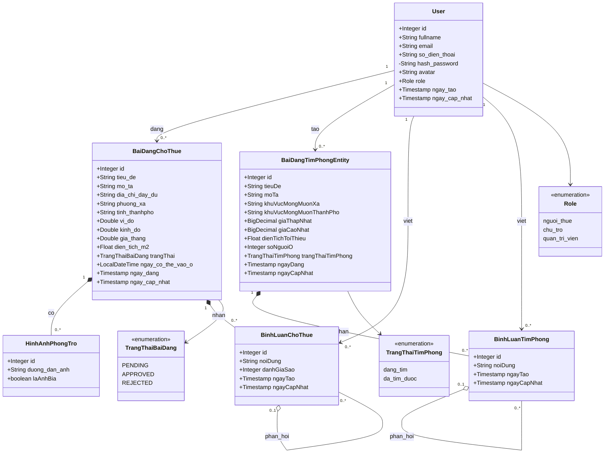

## 3. Mô hình động

### Sequence diagram - Admin duyệt bài đăng cho thuê

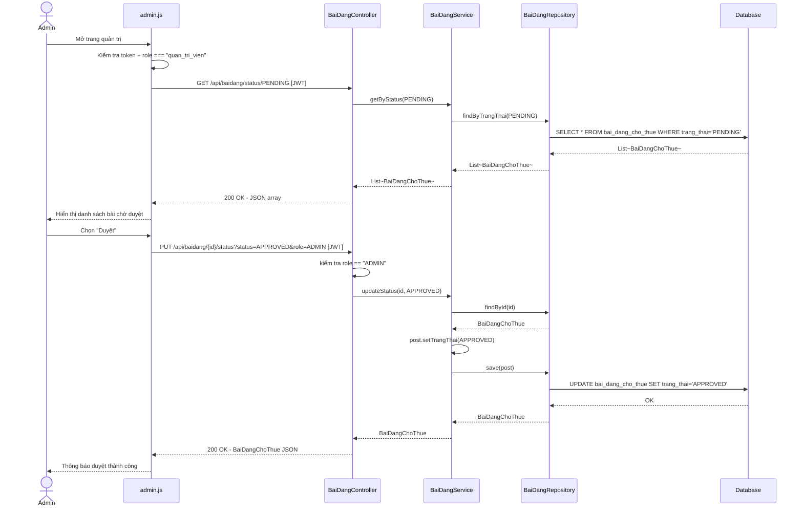

### Sequence diagram - Admin phân quyền người dùng

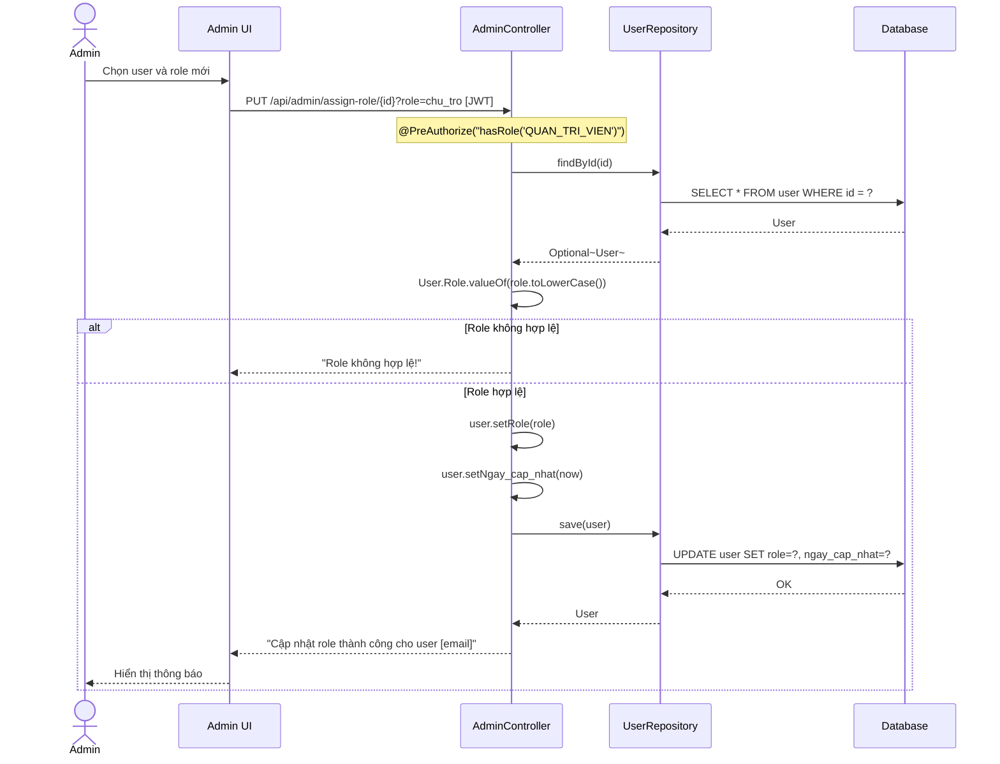

### Sequence diagram - Admin xóa bình luận vi phạm

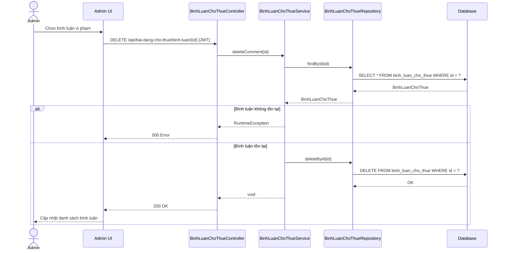

### Activity diagram - Quy trình duyệt bài đăng

```mermaid
flowchart TD
    Start([Bắt đầu]) --> A[Admin mở trang quản trị]
    A --> B{Kiểm tra localStorage:\ntoken tồn tại và role === quan_tri_vien?}
    B -- Không --> C[Hiển thị cảnh báo: Không có quyền]
    C --> End([Kết thúc])
    B -- Có --> D[Gọi API: GET /api/baidang/status/PENDING]
    D --> E{HTTP response OK?}
    E -- Không --> F[Hiển thị lỗi tải dữ liệu]
    F --> End
    E -- Có --> G[Hiển thị danh sách bài chờ duyệt]
    G --> H[Admin xem chi tiết bài đăng]
    H --> I{Admin chọn hành động?}
    I -- Duyệt --> J[PUT /api/baidang/{id}/status?status=APPROVED&role=ADMIN]
    I -- Từ chối --> K[PUT /api/baidang/{id}/status?status=REJECTED&role=ADMIN]
    I -- Xóa --> L[Xác nhận xóa]
    L --> M[DELETE /api/baidang/{id}]
    J --> N[Thông báo thành công]
    K --> N
    M --> N
    N --> O[Tải lại danh sách bài chờ duyệt]
    O --> End
```

### Statechart diagram - Trạng thái bài đăng cho thuê

> **Ghi chú:** `TrangThaiBaiDang` trong source code có đú ng 3 giá trị: `PENDING`, `APPROVED`, `REJECTED`. Không có trạng thái `DELETED`; việc xóa bài đăng là xóa bản ghi khỏi CSDL hoàn toàn qua `DELETE /api/baidang/{id}`.

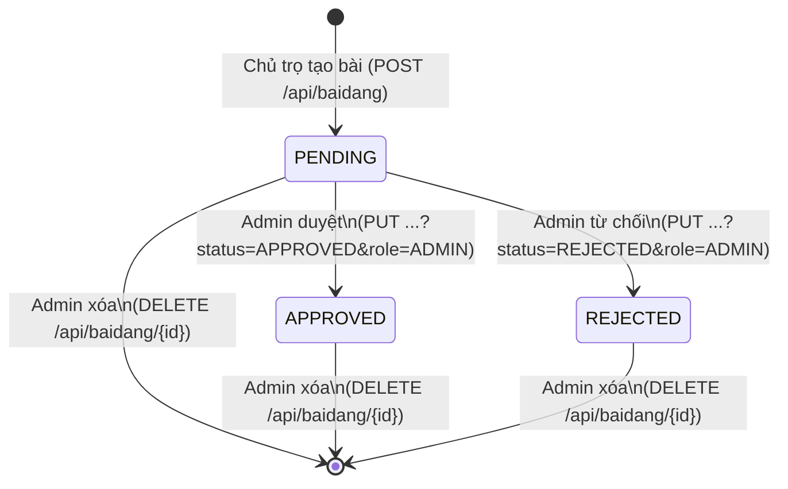

# B. Xây dựng mới

# 1. Architectural Design

## Lựa chọn kiến trúc triển khai

Hệ thống phù hợp với kiến trúc MVC kết hợp phân lớp Service - Repository trong Spring Boot.

Các lớp chính:

- **View:** Giao diện HTML/CSS/JavaScript trong `src/main/resources/static`, ví dụ `admin.html`, `admin.js`, `admin.css`.
- **Controller:** Nhận HTTP request, kiểm tra tham số và gọi service, ví dụ `AdminController`, `BaiDangController`, `BaiDangTimPhongController`, `BinhLuanChoThueController`, `BinhLuanTimPhongController`.
- **Service:** Xử lý nghiệp vụ như cập nhật trạng thái bài, tạo/xóa/cập nhật dữ liệu.
- **Repository:** Truy cập cơ sở dữ liệu qua Spring Data JPA.
- **Entity:** Ánh xạ bảng dữ liệu như `User`, `BaiDangChoThue`, `BaiDangTimPhongEntity`, `BinhLuanChoThue`, `BinhLuanTimPhong`.
- **Database:** Lưu trữ dữ liệu hệ thống.

Ưu điểm:

- **Tách biệt trách nhiệm:** UI, điều phối request, nghiệp vụ và truy cập dữ liệu được tách rõ.
- **Dễ bảo trì:** Có thể thay đổi giao diện hoặc nghiệp vụ mà ít ảnh hưởng tới các lớp khác.
- **Dễ mở rộng:** Có thể bổ sung dashboard, thống kê, khóa tài khoản, ẩn/hiện bình luận.
- **Phù hợp source code hiện tại:** Dự án đã sử dụng Spring Boot Controller/Service/Repository/Entity.

## Component/Module diagram

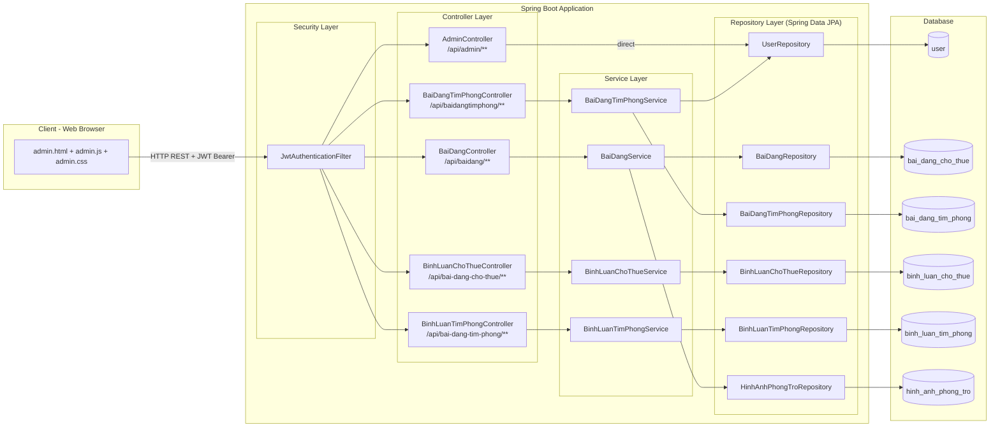

## Deployment diagram

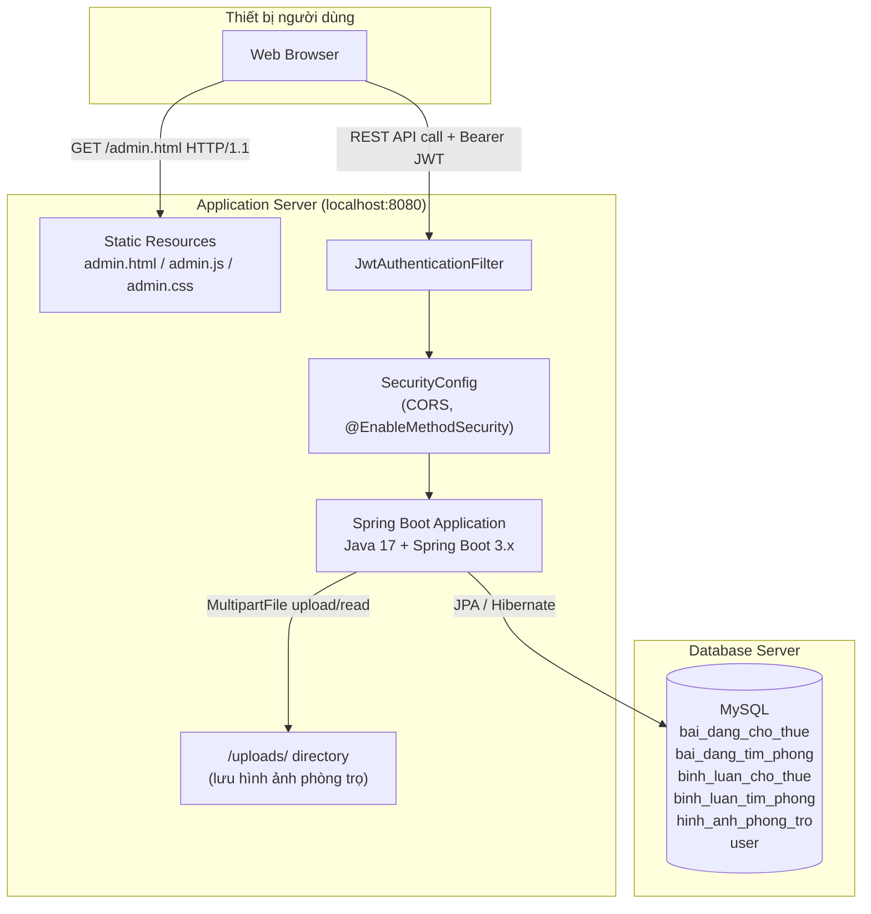

# 2. Detailed Design

## Detailed class diagram

```mermaid
classDiagram
    class AdminController {
        <<RestController>>
        -UserRepository userRepository
        -BCryptPasswordEncoder passwordEncoder
        +getAllUsers() List~User~
        +getUserById(Integer id) Optional~User~
        +assignRole(Integer id, String role) String
        +updateUser(Integer id, UserDTO dto) String
        +deleteUser(Integer id) String
    }

    class BaiDangController {
        <<RestController>>
        -BaiDangService baiDangService
        +getAll() List~BaiDangChoThue~
        +getAllWithPagination(int page, int size, ...) PaginationResponseDTO
        +getById(Integer id) Optional~BaiDangChoThue~
        +create(BaiDangChoThue baiDang) BaiDangChoThue
        +updateStatus(Integer id, TrangThaiBaiDang status, String role) BaiDangChoThue
        +getByStatus(TrangThaiBaiDang status) List~BaiDangChoThue~
        +delete(Integer id) void
    }

    class BaiDangTimPhongController {
        <<RestController>>
        -BaiDangTimPhongService baiDangTimPhongService
        +getAllWithPagination(int page, int size, ...) ResponseEntity
        +findByPostId(Integer id) ResponseEntity
        +createPost(BaiDangTimPhongDTO dto, BindingResult result) ResponseEntity
        +deletePost(Integer id) ResponseEntity
        +updatePost(Integer id, BaiDangTimPhongDTO dto, BindingResult result) ResponseEntity
    }

    class BinhLuanChoThueController {
        <<RestController>>
        -BinhLuanChoThueService binhLuanChoThueService
        +getCommentsByBaiDang(Integer id) List~CommentResponseDTO~
        +addComment(Integer id, CommentRequestDTO request, Integer userId) CommentResponseDTO
        +updateComment(Integer id, CommentRequestDTO request) CommentResponseDTO
        +deleteComment(Integer id) void
    }

    class BinhLuanTimPhongController {
        <<RestController>>
        -BinhLuanTimPhongService binhLuanTimPhongService
        +getCommentsByBaiDang(Integer id) List~CommentResponseDTO~
        +addComment(Integer id, CommentRequestDTO request, Integer userId) CommentResponseDTO
        +updateComment(Integer id, CommentRequestDTO request) CommentResponseDTO
        +deleteComment(Integer id) void
    }

    class BaiDangService {
        <<Service>>
        -BaiDangRepository baiDangRepository
        -HinhAnhPhongTroRepository hinhAnhRepository
        -GeocodingService geocodingService
        +getAllBaiDang() List~BaiDangChoThue~
        +getAllBaiDangWithPagination(int page, int size, ...) PaginationResponseDTO
        +getBaiDangById(Integer id) Optional~BaiDangChoThue~
        +saveBaiDang(BaiDangChoThue baiDang) BaiDangChoThue
        +updateStatus(Integer id, TrangThaiBaiDang status) BaiDangChoThue
        +getByStatus(TrangThaiBaiDang status) List~BaiDangChoThue~
        +deleteBaiDang(Integer id) void
    }

    class BaiDangTimPhongService {
        <<Service>>
        -BaiDangTimPhongRepository baiDangTimPhongRepository
        -UserRepository userRepository
        +getAllBaiDangTimPhongWithPagination(int page, int size, ...) PaginationResponseDTO
        +findById(Integer id) Optional~BaiDangTimPhongDTO~
        +createPost(BaiDangTimPhongDTO dto) void
        +updatePost(Integer id, BaiDangTimPhongDTO dto) void
        +deletePost(Integer id) void
    }

    class BinhLuanChoThueService {
        <<Service>>
        -BinhLuanChoThueRepository binhLuanChoThueRepository
        +getCommentsByBaiDang(Integer baiDangId) List~CommentResponseDTO~
        +addComment(Integer baiDangId, Integer userId, CommentRequestDTO request) CommentResponseDTO
        +updateComment(Integer commentId, CommentRequestDTO request) CommentResponseDTO
        +deleteComment(Integer commentId) void
    }

    class BinhLuanTimPhongService {
        <<Service>>
        -BinhLuanTimPhongRepository binhLuanTimPhongRepository
        +getCommentsByBaiDang(Integer baiDangId) List~CommentResponseDTO~
        +addComment(Integer baiDangId, Integer userId, CommentRequestDTO request) CommentResponseDTO
        +updateComment(Integer commentId, CommentRequestDTO request) CommentResponseDTO
        +deleteComment(Integer commentId) void
    }

    class UserRepository {
        <<Repository>>
        +findByEmail(String email) User
        +findById(Integer id) Optional~User~
        +findAll() List~User~
        +save(User user) User
        +deleteById(Integer id) void
    }

    class BaiDangRepository {
        <<Repository>>
        +findByTrangThai(TrangThaiBaiDang status) List~BaiDangChoThue~
        +findWithFilters(...) List~BaiDangChoThue~
        +countWithFilters(...) long
    }

    class BaiDangTimPhongRepository {
        <<Repository>>
        +findByIdWithUser(Integer id) Optional~BaiDangTimPhongEntity~
        +findWithFilters(...) List~BaiDangTimPhongEntity~
        +countWithFilters(...) long
    }

    class BinhLuanChoThueRepository {
        <<Repository>>
        +findByBaiDangChoThueIdAndBinhLuanChaIsNull(Integer id) List~BinhLuanChoThue~
        +findByBaiDangChoThueId(Integer id) List~BinhLuanChoThue~
        +findByUserId(Integer userId) List~BinhLuanChoThue~
    }

    class BinhLuanTimPhongRepository {
        <<Repository>>
        +findByBaiDangTimPhongIdAndBinhLuanChaIsNull(Integer id) List~BinhLuanTimPhong~
        +findByBaiDangTimPhongId(Integer id) List~BinhLuanTimPhong~
        +findByUserId(Integer userId) List~BinhLuanTimPhong~
    }

    AdminController ..> UserRepository : uses
    BaiDangController ..> BaiDangService : uses
    BaiDangTimPhongController ..> BaiDangTimPhongService : uses
    BinhLuanChoThueController ..> BinhLuanChoThueService : uses
    BinhLuanTimPhongController ..> BinhLuanTimPhongService : uses
    BaiDangService ..> BaiDangRepository : uses
    BaiDangTimPhongService ..> BaiDangTimPhongRepository : uses
    BaiDangTimPhongService ..> UserRepository : uses
    BinhLuanChoThueService ..> BinhLuanChoThueRepository : uses
    BinhLuanTimPhongService ..> BinhLuanTimPhongRepository : uses
```

## Detailed sequence diagram - Dashboard Admin

> **Ghi chú:** `GET /api/admin/dashboard` **chưa được triển khai** trong source code hiện tại. Sơ đồ dưới đây là thiết kế đề xuất dựa trên các repository đã có, có thể thực hiện bằng cách bổ sung `AdminDashboardController` và `DashboardService`.

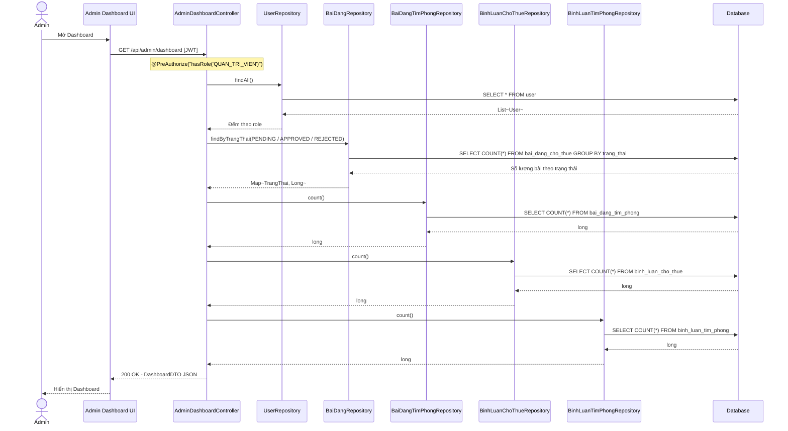

## ERD

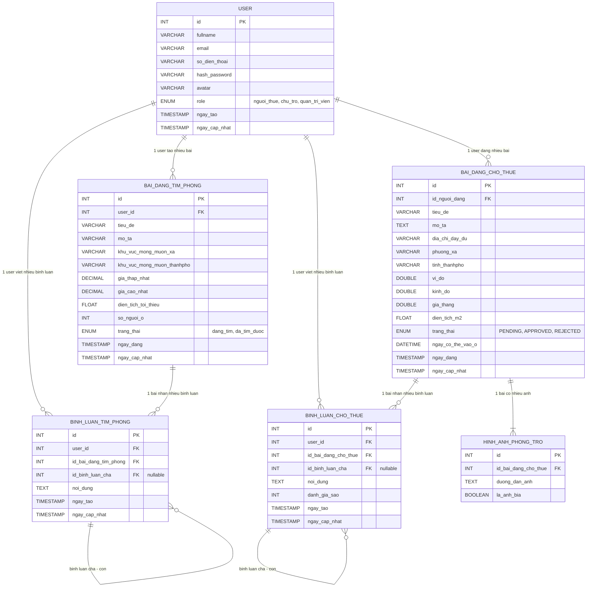

## Test case

| TC ID | Chức năng | Tiền điều kiện | Dữ liệu kiểm thử | Các bước thực hiện | Kết quả mong đợi | Độ ưu tiên |
|---|---|---|---|---|---|---|
| TC-ADM-01 | Truy cập trang Admin | User chưa đăng nhập | Không có token | Mở `/admin.html` | Hiển thị thông báo không có quyền | Cao |
| TC-ADM-02 | Truy cập trang Admin | User có role `nguoi_thue` | Token hợp lệ nhưng role không phải admin | Mở `/admin.html` | Hiển thị thông báo không có quyền | Cao |
| TC-ADM-03 | Truy cập trang Admin | User có role `quan_tri_vien` | Token admin hợp lệ | Mở `/admin.html` | Hiển thị nội dung quản trị | Cao |
| TC-ADM-04 | Xem danh sách user | Admin đã đăng nhập | Gọi `GET /api/admin/users` | Gửi request kèm JWT | Trả về danh sách user | Cao |
| TC-ADM-05 | Xem chi tiết user | User tồn tại | id = 1 | Gọi `GET /api/admin/users/1` | Trả về thông tin user | Cao |
| TC-ADM-06 | Xem chi tiết user không tồn tại | User không tồn tại | id không có trong DB | Gọi API chi tiết | Trả về rỗng hoặc thông báo không tồn tại | Trung bình |
| TC-ADM-07 | Phân quyền user hợp lệ | User tồn tại | role = `chu_tro` | Gọi `PUT /api/admin/assign-role/{id}` | Role được cập nhật thành công | Cao |
| TC-ADM-08 | Phân quyền user không hợp lệ | User tồn tại | role = `admin_fake` | Gọi API phân quyền | Hệ thống báo role không hợp lệ | Cao |
| TC-ADM-09 | Cập nhật thông tin user | User tồn tại | fullname, email, phone mới | Gọi `PUT /api/admin/update-user/{id}` | User được cập nhật | Cao |
| TC-ADM-10 | Xem bài chờ duyệt | Có bài `PENDING` | status = `PENDING` | Gọi `GET /api/baidang/status/PENDING` | Trả về danh sách bài chờ duyệt | Cao |
| TC-ADM-11 | Duyệt bài cho thuê | Bài tồn tại ở trạng thái `PENDING` | status = `APPROVED`, role = `ADMIN` | Gọi `PUT /api/baidang/{id}/status` | Bài chuyển sang `APPROVED` | Cao |
| TC-ADM-12 | Từ chối bài cho thuê | Bài tồn tại | status = `REJECTED`, role = `ADMIN` | Gọi API cập nhật trạng thái | Bài chuyển sang `REJECTED` | Cao |
| TC-ADM-13 | Xóa bài cho thuê | Bài tồn tại | id bài đăng | Gọi `DELETE /api/baidang/{id}` | Bài bị xóa khỏi hệ thống | Cao |
| TC-ADM-14 | Xem bài tìm phòng | Có dữ liệu bài tìm phòng | page, size | Gọi `GET /api/baidangtimphong/` | Trả về danh sách phân trang | Cao |
| TC-ADM-15 | Xóa bài tìm phòng | Bài tìm phòng tồn tại | id bài | Gọi `DELETE /api/baidangtimphong/{id}` | Bài bị xóa | Cao |
| TC-ADM-16 | Xem bình luận bài cho thuê | Bài có bình luận | id bài cho thuê | Gọi `GET /api/bai-dang-cho-thue/{id}/binh-luan` | Trả về danh sách bình luận | Trung bình |
| TC-ADM-17 | Xóa bình luận bài cho thuê | Bình luận tồn tại | id bình luận | Gọi `DELETE /api/bai-dang-cho-thue/binh-luan/{id}` | Bình luận bị xóa | Cao |
| TC-ADM-18 | Xem bình luận bài tìm phòng | Bài có bình luận | id bài tìm phòng | Gọi `GET /api/bai-dang-tim-phong/{id}/binh-luan` | Trả về danh sách bình luận | Trung bình |
| TC-ADM-19 | Xóa bình luận bài tìm phòng | Bình luận tồn tại | id bình luận | Gọi `DELETE /api/bai-dang-tim-phong/binh-luan/{id}` | Bình luận bị xóa | Cao |
| TC-ADM-20 | Xem dashboard | Có dữ liệu hệ thống | Token admin | Gọi endpoint dashboard dự kiến | Hiển thị tổng số user, bài đăng, bình luận | Trung bình |

# Đối chiếu source code hiện tại

## Đã triển khai

| Chức năng | Class/File | Endpoint |
|---|---|---|
| Xem danh sách user | `AdminController` | `GET /api/admin/users` |
| Xem chi tiết user | `AdminController` | `GET /api/admin/users/{id}` |
| Phân quyền user | `AdminController` | `PUT /api/admin/assign-role/{id}` |
| Cập nhật thông tin user | `AdminController` | `PUT /api/admin/update-user/{id}` |
| Xóa user | `AdminController` | `DELETE /api/admin/delete-user/{id}` |
| Xem bài đăng theo trạng thái | `BaiDangController` + `admin.js` | `GET /api/baidang/status/{status}` _(lưu ý: `GET /api/baidang/all` chỉ trả về bài `APPROVED`, không phải toàn bộ)_ |
| Duyệt / Từ chối bài | `BaiDangController` + `admin.js` | `PUT /api/baidang/{id}/status?status=...&role=ADMIN` _(kiểm tra quyền qua query param `role`, **không** dùng Spring Security `@PreAuthorize`)_ |
| Xóa bài cho thuê | `BaiDangController` + `admin.js` | `DELETE /api/baidang/{id}` |
| Xem danh sách bài tìm phòng | `BaiDangTimPhongController` | `GET /api/baidangtimphong/` |
| Xóa bài tìm phòng | `BaiDangTimPhongController` | `DELETE /api/baidangtimphong/{id}` |
| Xem bình luận bài cho thuê | `BinhLuanChoThueController` | `GET /api/bai-dang-cho-thue/{id}/binh-luan` |
| Xóa bình luận bài cho thuê | `BinhLuanChoThueController` | `DELETE /api/bai-dang-cho-thue/binh-luan/{id}` _(Đây là endpoint dùng chung, **không có** `@PreAuthorize` riêng cho Admin)_ |
| Xem bình luận bài tìm phòng | `BinhLuanTimPhongController` | `GET /api/bai-dang-tim-phong/{id}/binh-luan` |
| Xóa bình luận bài tìm phòng | `BinhLuanTimPhongController` | `DELETE /api/bai-dang-tim-phong/binh-luan/{id}` _(Đây là endpoint dùng chung, **không có** `@PreAuthorize` riêng cho Admin)_ |
| Repository lọc bình luận theo user | `BinhLuanChoThueRepository`, `BinhLuanTimPhongRepository` | `findByUserId(Integer)` _(có trong repository, chưa expose qua API)_ |

## Cần bổ sung để hoàn thiện yêu cầu

| Yêu cầu | Mô tả bổ sung cần thiết |
|---|---|
| Vô hiệu hóa / kích hoạt tài khoản | Thêm trường `boolean enabled` vào entity `User`, thêm endpoint `PUT /api/admin/toggle-user/{id}` |
| Ẩn / hiện bình luận | Thêm trường `boolean hienThi` vào `BinhLuanChoThue` và `BinhLuanTimPhong`, thêm endpoint toggle |
| Dashboard thống kê | Tạo mới `AdminDashboardController` và expose `GET /api/admin/dashboard` tổng hợp số liệu từ các repository |
| API xem bình luận theo người dùng | Expose `findByUserId()` đã có trong repository qua endpoint mới |
| Giao diện Admin đầy đủ | UI hiện tại (`admin.html`) chỉ xử lý bài cho thuê chờ duyệt; cần bổ sung tab quản lý user, bài tìm phòng, bình luận và dashboard |
